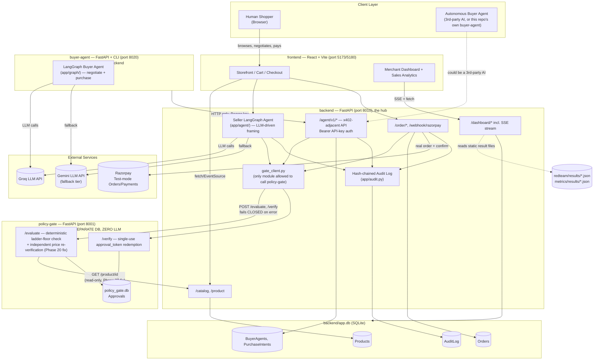
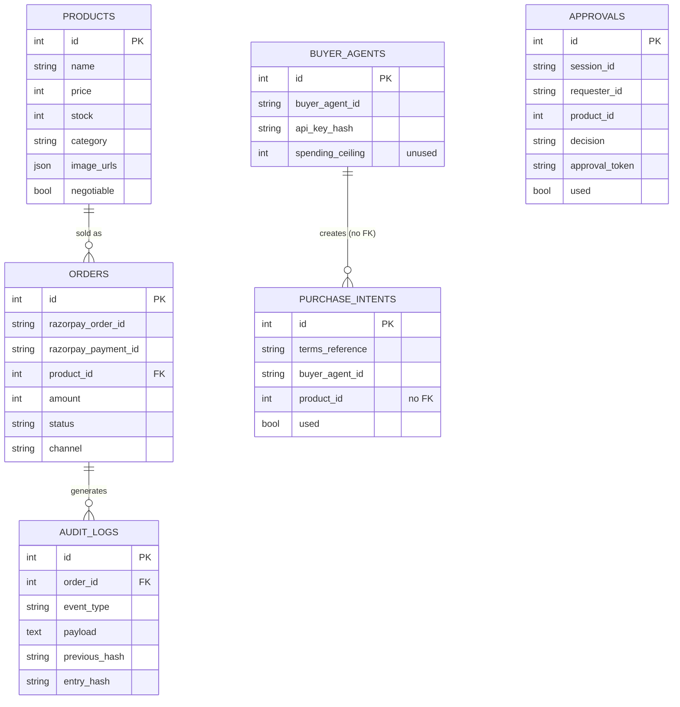
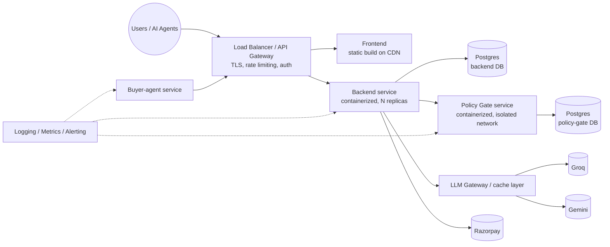

# Bounded Agentic Checkout — Complete Technical Project Audit

*Prepared as a full-codebase architecture audit. Every claim below is either a fact confirmed against the actual code/config/git history, or explicitly flagged as an inference. Nothing in this document is invented.*

---

## Quick Answers

**1. Project name:** Bounded Agentic Checkout (repo: `Razorpay-Hackathon-`, storefront persona "Priya's Shop")

**2. One-paragraph understanding:** A Razorpay-backed e-commerce checkout system where both human shoppers and autonomous AI buyer agents can negotiate discounts on a handmade-goods storefront — but no LLM is ever the authority on whether a discount is real. Every negotiated offer, from either a human-facing seller agent or an agent-to-agent (x402-adjacent) API, must pass through a separate, deterministic, zero-LLM **Policy Gate** microservice before it can become a real Razorpay charge. The system layers a hash-chained tamper-evident audit log, a live merchant dashboard, and — unusually for a project at this stage — two independent adversarial red-team test suites run against the live, running services, with findings (including one critical, since-fixed vulnerability) documented plainly rather than hidden.

**3. Detected architecture:** Four independently-deployable services (backend, policy-gate, buyer-agent, frontend), each with its own venv/dependencies, communicating exclusively over HTTP — no shared code imports between backend and either policy-gate or buyer-agent, confirmed both by direct source inspection and by a dedicated test (`test_17_5_buyer_agent_isolation.py`) that enforces it via `ModuleNotFoundError` and an AST import allow-list.

**4. Detected tech stack:** FastAPI + SQLAlchemy + SQLite (backend, policy-gate), LangGraph + Groq/Gemini LLMs (seller and buyer negotiation agents), React 18 + Vite + Tailwind CSS (frontend, no TypeScript), Razorpay Test Mode (payments), plain `requests`/`httpx` for inter-service HTTP — no message queue, no cache layer, no container orchestration.

**5. Major modules:** `backend` (hub — catalog, orders, human negotiation, agent-commerce API, dashboard reads, audit log), `policy-gate` (sole discount-approval authority), `buyer-agent` (autonomous LangGraph shopping agent, CLI + HTTP), `frontend` (storefront + Merchant Dashboard + Sales Analytics), plus five auxiliary, non-shipping directories: `redteam/`, `red-team-agent/` (adversarial test suites), `tests/phase17_trust_boundary/` (pytest trust-boundary suite), `metrics/` and `analysis/` (revenue-recovery/impact simulations), `demo/` (scripted failure-mode demos), `docs/` (API contracts, x402 conformance notes).

**6. Current implementation status (headline):** Functionally complete for a local demo — all four services run, a real negotiation-to-payment loop works end-to-end for both humans and AI agents, and the one critical security finding from adversarial testing has been fixed and re-verified. **Not production-ready**: no authentication on the human-facing API, no migrations tooling, no automated frontend tests, no CI/CD, no containerization, and the merchant/product-admin surface has zero access control.

---

# 1. Project Overview

## Simple explanation

Imagine a small online shop — "Priya's Shop," selling handmade home decor. Like any shop, prices are basically fixed, but Priya is willing to haggle a little if a customer seems like they're about to walk away without buying. This project builds that haggling into the checkout flow: if you add something to your cart and then hesitate, Priya's AI assistant notices and messages you with a real offer. You can negotiate back and forth, and if you agree, you check out at the real Razorpay payment page at the new price.

The twist, and the actual point of the whole project: the AI assistant doing the talking is *not* the thing that decides whether your discount is real. There's a second, much more boring piece of software sitting behind it — a "Policy Gate" — that has no AI in it at all, just plain rules ("this product can go up to 15% off, no further"). No matter what the AI says or how convincing the conversation is, if the Gate doesn't sign off, the discount doesn't happen. That same Gate also works when the "shopper" isn't a person at all — another company's AI agent can shop on this store too, negotiating the same way, checked by the same Gate.

On top of that, the project has a "Merchant Dashboard" where the shop owner can watch all of this happen live — see negotiations as they occur, verify that the record of every transaction hasn't been tampered with, and even see the results of the team's own attempts to break their own system.

## Technical explanation

Bounded Agentic Checkout is a four-service system built around one architectural thesis: **separate the LLM's job (framing a negotiation, producing natural language) from the authorization job (deciding whether a discount is real money)**, and enforce that separation at the network boundary, not just in code style.

- **`backend`** (FastAPI, port 8010) is the hub: product catalog, Razorpay order creation/confirmation/webhook handling, a LangGraph-based seller negotiation agent for human shoppers, a public agent-commerce HTTP API (`/agent/v1/*`, partially x402-V2-conformant) for autonomous buyer agents, a hash-chained audit log, and all of the Merchant Dashboard's read endpoints (including one SSE stream).
- **`policy-gate`** (FastAPI, port 8001) is a structurally separate process with its own SQLite database and its own dependency set. It exposes exactly two meaningful endpoints — `/evaluate` and `/verify` — and is the only thing in the system that can mint or redeem an `approval_token`. It contains zero LLM calls. As of the current commit, it also independently re-verifies any caller-claimed price against the backend's own catalog before evaluating a discount (a fix for a critical vulnerability discussed at length in §12/§13).
- **`buyer-agent`** (FastAPI + CLI, port 8020) is a separate LangGraph agent that shops *as a client* of `backend`'s public agent-commerce API — it has zero Python-level import coupling to `backend`, verified by a dedicated isolation test.
- **`frontend`** (React 18 + Vite + Tailwind, port 5173/5180) serves the storefront, cart, Merchant Dashboard, and Sales Analytics — no TypeScript, no state-management library (plain `useState`/`useEffect`/browser `localStorage`/window events), no automated test coverage.

The system deliberately runs entirely on local SQLite with no migrations tool, no containerization, and no CI — appropriate for its actual maturity level (a heavily-tested hackathon/portfolio submission), explicitly *not* appropriate for production traffic without substantial hardening (detailed throughout this report).

**Target users (inferred):** Not a real merchant deployment — the actual "users" are (a) hackathon/competition judges evaluating the submission, and (b) by the project owner's own stated intent in this conversation, an internship-evaluating engineering team reading the GitHub repository. The "Priya's Shop" persona and its content are a demo fixture, not a real business.

**Core idea:** A deterministic, auditable authorization boundary between "an LLM negotiates" and "money moves."

**Main workflow:** Shopper (human or AI) browses catalog → adds to cart / expresses intent → an LLM-driven negotiation happens → every candidate offer is checked against `policy-gate` → an approved offer yields a single-use `approval_token` → checkout redeems that token via Razorpay, independently re-verified server-side → the whole story is written to a hash-chained audit log the merchant can inspect and cryptographically re-verify live.

**What makes it unique/useful:** Two things that are genuinely uncommon at this project's maturity level: (1) the negotiation architecture is symmetric — the identical Policy Gate authorizes both the human-facing and agent-to-agent channels, which is a real, load-bearing design decision, not a marketing claim; (2) the project has been adversarially tested against its own live, running services (not unit-tested against mocks) by two independent red-team harnesses plus a dedicated pytest trust-boundary suite, and the results — including a critical vulnerability that was found, publicly documented, fixed, and the fix re-verified by re-running the original exploit — are published in `WHAT_BROKE.md` rather than omitted.

**Current maturity level:** Late-stage hackathon/portfolio project. Feature-complete for its demo scope; explicitly and honestly *not* hardened for real traffic (see §13, §14, §18).

**What the final intended product appears to be:** A demonstration/reference implementation of "bounded agentic commerce" — proving that LLM-driven negotiation and deterministic-gate-controlled money movement can coexist safely for both human and AI-agent shoppers — rather than a shippable multi-tenant SaaS product. Nothing in the codebase (no tenant model, no per-merchant config, no billing) suggests multi-merchant productization was ever a near-term goal.

---

# 2. Project History / Evolution

**Important caveat, stated plainly:** This repository's `origin` remote had exactly **one** commit ("Phase 1: foundation") for most of its life. The 13-commit history now on `origin/main` was **retroactively reconstructed** — real work was done across many sessions but never committed incrementally, then later grouped into logically-themed commits based on the *current* content of each file, not a captured line-by-line chronology. Every commit message says so explicitly. **This section is therefore an inferred timeline**, built from (a) the phase-numbered commit messages and their diffs, (b) in-code comments that reference "Phase N" decisions (a strong, consistent convention throughout this codebase), and (c) `WHAT_BROKE.md`'s own numbered, dated findings. It is a *faithful reconstruction of what was built and in roughly what order*, not a verified minute-by-minute history.

## Chronological reconstruction

**Phase 1 — Foundation** (commit `8bd9a73`, 2026-08-24)
Catalog, orders, real Razorpay test-mode payments, and a policy-gate *stub* (implied not yet the full deterministic-evaluation service). This is the only phase with a real, non-reconstructed commit timestamp.

**Phase 2–3 — Backend core, separated Policy Gate, hash-chained audit log** (`f1c50fa`)
The Policy Gate becomes its own real FastAPI service with its own DB (the "Level 2" architecture decision referenced in `policy-gate/README`-style comments). `app/audit.py`'s hash-chain mechanism is introduced here.

**Phase 4 — Agent layers** (`9068bec`)
The seller-side LangGraph negotiation agent (`backend/app/agent/`), the `buyer-agent` service, and the first version of the agent-commerce API (`/agent/v1/*`) are introduced. In-code comments reference "Phase 4a" (frozen API contract, `docs/agent-commerce-interface.md`) and "Phase 4b" (a later revision noted in the OpenAPI spec's description field) as sub-phases.

**Phase 5–6 — Revenue-recovery simulation + Merchant Dashboard** (`1d7a400`)
`analysis/simulate_revenue_impact.py` (scripted-persona simulation) and the first Merchant Dashboard read endpoints/UI.

**Phase 7–10 — Storefront UI/UX** (`fabf8dc`)
Catalog browsing, cart, and — significantly — **Phase 10** replaces an earlier manual "Start Negotiation" button with the current seller-initiated, cart-abandonment-triggered negotiation popup. This is a confirmed **abandoned/replaced approach**: `WHAT_BROKE.md` item #5 and multiple in-code comments (`CatalogView.jsx`, `ProductDetail.jsx`) explicitly record that the manual button was removed everywhere once the automated trigger shipped, specifically to prevent two divergent entry points into the same flow.

**Phase 11 — Adversarial / red-team suites** (`9851140`)
Two independent live red-team harnesses (`redteam/`, `red-team-agent/`) are built and run against the live system. Five real vulnerabilities are found and fixed in this phase (per `WHAT_BROKE.md` §6): a Policy Gate `/verify` TOCTOU double-spend race, cross-buyer token theft, cross-session token theft (human channel), a same-session negotiation race, and a webhook out-of-order status regression. Three findings are reported as still-open at this point.

**Phase 12–17 — x402/agent-commerce conformance, failure-mode demos, dashboard deepening, two-register design system** (`e17a1db`)
This is the largest single reconstructed commit, bundling several distinct sub-efforts visible in code comments: x402 V2 wire-format conformance work (`docs/x402-v2-conformance.md`, `docs/x402-conformance-diff.md`, `app/agent_commerce/x402_headers.py`), `demo/failure_beats/` scripted resilience demos, the original "two-register" visual design (storefront warm/handmade vs. dashboard dark "instrument panel"), and — critically — **Phase 17**, a dedicated adversarial pytest suite (`tests/phase17_trust_boundary/`) that found and documented the project's single most serious open finding: Policy Gate's price-tampering vulnerability (§9 in `WHAT_BROKE.md`), left explicitly unfixed at this point per that phase's own "report, don't fix" instruction.

**Phase 18 — Submission-readiness audit** (`efe82de`, 2026-08-31)
A cold-start reproducibility audit (found and fixed a systemic `localhost` vs `127.0.0.1` latency bug in 10 separate files), secrets-hygiene check, the discovery that **almost no historical "paid" order was a real payment** (fixed by adding `POST /order/confirm` with independent signature re-verification), a double-click-fires-two-orders bug fix, and a revenue-inflation-from-unpaid-orders bug fix. `WHAT_BROKE.md` and `RUBRIC_MAPPING.md` are written in this phase.

**Phase 19 — Frontend shell rebuild** (`be6580a`, 2026-09-05)
A full visual rebuild: the old top-tab dashboard nav is **replaced** (confirmed replacement, not addition) by a persistent left sidebar with a manual collapse toggle; a shared `Card`/`Sparkline` component system moves the dashboard/analytics surfaces from a dark "instrument panel" register onto the storefront's own warm palette. The Audit Trail panel is deliberately *not* restyled (kept dark/terminal) as an explicit design decision.

**Phase 20 — Real product photography, critical security fix, negotiation-to-cart integration** (`a8d94ca`, `886db32`, `0152552`, `1bd8ee6`, `06abf63`, all 2026-09-05, same day)
Five distinct efforts land same-day: (1) 11 of 12 catalog placeholder SVGs are replaced with individually-vetted real photos (one is deliberately left as SVG after failed sourcing attempts); (2) **the Phase 17 critical vulnerability is finally fixed** — Policy Gate now independently re-verifies price against the backend catalog, closed by re-running the original exploit test against the patched system; (3) a real, load-bearing bug is fixed where an accepted negotiation's discount never actually reached the cart or Razorpay checkout — only the popup's own direct-pay button honored it; (4) a further bug where negotiation only ever triggered once per cart, permanently, for the first product added, is fixed with a per-product "handled" tracking model; (5) README screenshots and a plain-language project overview are added.

## What was NOT found evolving

- **No abandoned AI/ML pipeline pivots** — the LLM provider chain (Groq primary → Groq fallback → Gemini fallback) appears to have been the design from Phase 4 onward; no evidence of a different model/provider having been ripped out.
- **No database migration** — SQLite has been the only database technology throughout; no evidence Postgres or another DB was ever wired in and reverted.
- **No frontend framework change** — React+Vite+Tailwind throughout; no evidence of an earlier Next.js/CRA/other setup.
- **One confirmed abandoned UI pattern** — the manual "Start Negotiation" button (Phase 7-10 → removed in Phase 10, per `WHAT_BROKE.md` #5).
- **One confirmed image-sourcing pivot** — picsum.photos (random) → LoremFlickr (keyword-searched, rejected after a real person's face and a competitor's logo appeared on unrelated products) → generated SVG placeholders (`WHAT_BROKE.md` #3/#4) → real, individually-vetted photography (Phase 20).

---

# 3. Complete Feature Inventory

| Feature | Description | Where Implemented | Status | Dependencies | Notes |
|---|---|---|---|---|---|
| Product catalog browsing | Grid of products with category filter, ratings, negotiable badge | `frontend/src/pages/Storefront.jsx`, `backend/app/routes/catalog.py` | ✅ | backend `/catalog` | |
| Product detail page | Gallery, reviews, EMI-style breakdown (cosmetic only) | `frontend/src/pages/ProductDetail.jsx` | ✅ (core) / ⚪ (EMI display) | backend `/product/{id}` | EMI breakdown explicitly non-functional per in-code comment |
| Add to cart | localStorage-persisted cart, cross-tab-safe via `cart:updated` window event | `frontend/src/lib/cart.js` | ✅ | none (client-only) | No server-side cart at all |
| Cart-abandonment-triggered negotiation | Auto-starts a real negotiation session after a configurable idle threshold | `frontend/src/hooks/useCartAbandonment.js`, backend `/negotiate/start` | ✅ | Groq/Gemini, policy-gate | Per-product "handled" tracking added Phase 20; previously only fired once, ever, for the first product |
| Human seller negotiation (LLM) | Multi-turn negotiation, LangGraph state machine, discount ladder | `backend/app/agent/{nodes,graph,discount_ladder}.py` | ✅ | Groq/Gemini, policy-gate | Deterministic discount % from ladder; LLM only frames the message |
| Negotiated price reaching cart/checkout | Accepted offer's approval_token/amount persists to cart and is redeemed at real checkout | `frontend/src/lib/cart.js` (`markNegotiationAccepted`), `Cart.jsx` | ✅ (fixed Phase 20) | — | Previously broken — see §12 |
| Real Razorpay checkout | Hosted Razorpay Checkout widget, test mode | `frontend/src/lib/checkout.js`, backend `/order/create` | ✅ | Razorpay test keys | |
| Independent payment confirmation | Backend re-verifies Razorpay's payment signature itself | backend `/order/confirm` (`payments.py`) | ✅ (Phase 18) | Razorpay `verify_payment_signature` | Historically the *only* real gap — see §12 |
| Razorpay webhook handling | Async payment status updates via webhook | backend `/webhook/razorpay` | 🟡 | Razorpay webhook + public tunnel | Never end-to-end verified locally (no public tunnel ever run); no replay/dedup protection (confirmed red-team finding, open) |
| Deterministic Policy Gate | Sole authority on discount approval, zero LLM | `policy-gate/app/routes/evaluate.py` | ✅ | none (pure logic + one HTTP call back to backend) | Now independently re-verifies price (Phase 20 fix) |
| Approval token issue/redeem | Single-use, HMAC-derived token gating a discount | `policy-gate/app/routes/evaluate.py` (`_generate_token`), `/verify` | ✅ | — | Atomic `UPDATE...WHERE used=0` claim (race-fixed Phase 11) |
| Hash-chained audit log | Tamper-evident, per-session-chained event log | `backend/app/audit.py` | ✅ | none | Verified live via a self-service "Verify Chain Integrity" button |
| Audit-trail tamper-demo sandbox | Lets a viewer deliberately break a chain and watch verification catch it | `backend/app/routes/dashboard.py` (`/dashboard/audit-trail/sandbox/*`) | ✅ | audit.py | Shares the real `audit_logs` table (logical, not physical, isolation) — a documented, intentional design, corrected in docs after being initially mis-assumed isolated |
| Agent-commerce API (x402-adjacent) | Public HTTP API for autonomous buyer agents: register/catalog/negotiate/purchase/pay/status | `backend/app/routes/agent_commerce.py` | ✅ | Bearer API-key auth | `/purchase` always returns 402 by design (x402-style payment-required flow) |
| x402 V2 wire-format conformance | PAYMENT-REQUIRED/SIGNATURE/RESPONSE headers, CAIP-2 network ids | `backend/app/agent_commerce/x402_headers.py` | 🟡 | — | Wire-format conformant; settlement model explicitly, deliberately NOT onchain (fiat/Razorpay) — documented, not hidden |
| Buyer-agent CLI | One-shot autonomous shopping via natural-language goal | `buyer-agent/app/main.py` | ✅ | Groq/Gemini, backend API | `--aggressive` test flag to probe the gate's ceiling |
| Buyer-agent HTTP interface | Interactive `/shopper/start` + `/shopper/chat`, human-in-the-loop | `buyer-agent/app/routes/shopper.py`, `app/graph/*` | ✅ | LangGraph `interrupt()` | No session timeout/expiry — paused sessions persist in memory indefinitely (documented open gap) |
| Merchant Dashboard — Overview | Sales summary, audit trail, policy gate status, live agent activity map | `frontend/src/pages/dashboard/DashboardHome.jsx` + panels | ✅ | SSE stream | |
| Merchant Dashboard — Human Negotiations tab | Live-updating feed of real negotiation sessions | `HumanNegotiationFeed.jsx`, backend `/dashboard/negotiations` | ✅ | SSE | |
| Merchant Dashboard — AI Buyer Agents tab | Chat-style view of agent-to-agent conversations | `AgentConversationsPage.jsx`, `ConversationList/Item`, `ChatThread/Bubble` | ✅ | SSE, backend `/dashboard/agent-activity` | |
| Live SSE updates | Single shared EventSource per dashboard page | `frontend/src/hooks/useDashboardStream.js`, backend `/dashboard/stream` | ✅ | native `EventSource` | No manual reconnect/backoff — relies on browser default |
| Security Posture panel | Reads red-team suites' own JSON result files, displays live | `SecurityPosturePanel.jsx`, backend `/dashboard/security-posture` | ✅ | `redteam/results/*.json` on disk | Reads static files off disk, not live-executed from the dashboard |
| Revenue Recovery (Simulated) panel | Displays `metrics/recovery_sim.py`'s output with an explicit "simulated" disclosure | `RecoverySimulationPanel.jsx`, backend `/dashboard/recovery-simulation` | ✅ | `metrics/results/recovery_sim.json` on disk | Explicitly, prominently labeled as simulated, not measured |
| Sales Analytics page | Real order/negotiation trend charts, hand-rolled SVG | `frontend/src/pages/SalesAnalyticsPage.jsx`, backend `/dashboard/analytics` | ✅ | — | No charting library; explicit "trends, not live events" framing |
| Sidebar navigation + collapse | Persistent left nav across all pages, manual collapse w/ localStorage persistence | `frontend/src/components/Sidebar.jsx` | ✅ (Phase 19-20) | — | |
| Product image gallery (real photos) | 11/12 products use real, individually-vetted photography | `backend/scripts/seed_catalog.py`, `frontend/public/images/products/` | ✅ (11/12) | — | 1 product deliberately kept on generated SVG after failed sourcing |
| Admin catalog view | Internal "Catalog (admin)" page — browse, negotiate, or buy at listed price | `frontend/src/components/CatalogView.jsx`, mounted at `/` | 🔴 (no auth) | — | Publicly reachable at the app's own root route with zero access control — see §13 |
| Product creation API | `POST /product` | `backend/app/routes/catalog.py` | 🟡 | — | Endpoint exists, exercised by no frontend UI found; no auth |
| Buyer-agent spending ceiling | `BuyerAgent.spending_ceiling` DB column | `backend/app/models/buyer_agent.py` | ⚪ | — | Column exists, confirmed in `docs/agent-commerce-interface.md` as never settable or enforced anywhere |
| Recommendations row | "Customers also viewed," same-category filter | `frontend/src/components/RecommendationsRow.jsx` | ✅ | — | Explicitly not ML-based — simple category filter, documented as such in-code |
| AI-generated customer mindset summary | Best-effort LLM narrative attached to a closed negotiation, dashboard-only | `backend/app/agent/nodes.py` (`close_negotiation`) | ✅ | Groq/Gemini | Explicitly labeled "LLM-generated insight — not a verified customer profile" in the UI |
| Demo fallback mode | Synthetic LLM/Razorpay responses if live providers fail during a demo | `backend/app/config.py` (`DEMO_FALLBACK_MODE`) | 🟡 | — | Exists in config and referenced in `decide_to_offer`; full extent of coverage not exhaustively traced in this audit |
| Cold-start reproducibility | README setup instructions verified via a real clean-clone audit | `README.md` "Known Gotchas" | ✅ | — | |
| Automated adversarial testing | Two independent red-team suites + a 6-file pytest trust-boundary suite, run against live services | `redteam/`, `red-team-agent/`, `tests/phase17_trust_boundary/` | ✅ | live running services | Not CI-wired — manual, local execution only |
| Automated unit/integration tests (app code) | Any tests for `backend`/`policy-gate`/`buyer-agent`/`frontend` application logic itself | `backend/tests/test_audit_hash_chain.py` (1 file) | 🔴 | — | Exactly one non-adversarial test file in the entire repo; buyer-agent, policy-gate, frontend have **zero** |
| CI/CD pipeline | Automated build/test/deploy on push | — | 🔴 | — | No `.github/workflows/`, no CI config of any kind found anywhere in the repo |
| Containerization | Docker/compose for any service | — | 🔴 | — | No Dockerfile, no docker-compose.yml found anywhere |
| Database migrations tooling | Alembic or equivalent | — | 🔴 | — | Hand-rolled idempotent `ALTER TABLE` runner in `database.py` instead; no down-migrations, no schema versioning |
| Authentication for human shoppers | Login/session for storefront/cart/checkout | — | 🔴 | — | No user accounts anywhere in the system; cart is anonymous/local-only |
| Authorization for admin/catalog-write routes | RBAC or any access control on `/product` POST, `CatalogView` UI | — | 🔴 | — | Confirmed absent |

---

# 4. Complete Tech Stack

## Frontend

| Category | Choice | Version | Notes |
|---|---|---|---|
| Framework | React | `^18.3.1` | |
| Language | JavaScript (JSX) | — | **No TypeScript anywhere in the project** |
| Routing | `react-router-dom` | `^7.18.2` | `BrowserRouter`, nested routes |
| Styling | Tailwind CSS | `^3.4.15` | Two custom "registers" (color-token families) — storefront warm palette (`clay`/`putty`/`moss`/`ink`/`ivory`) and dashboard (`panel`/`content`, reusing stock `slate`/`violet`) |
| State management | None (library) | — | Plain `useState`/`useEffect`; cross-component sync via `localStorage` + custom `window` events (`cart:updated`) |
| Forms | None (library) | — | Plain controlled inputs |
| Build tool | Vite | `^5.4.11` (`@vitejs/plugin-react` `^4.3.4`) | Minimal config — no proxy, no aliases |
| CSS tooling | PostCSS `^8.4.49`, Autoprefixer `^10.4.20` | | |
| Fonts | Fraunces (display/serif), Inter (body/sans), JetBrains Mono (dashboard numeric/log) | | Loaded via Google Fonts `<link>` in `index.html` |
| Payments UI | Razorpay Checkout.js (hosted widget, `<script src="https://checkout.razorpay.com/v1/checkout.js">`) | | Never a custom card form (PCI scope avoidance, explicit design note) |
| Testing | **None** | — | No vitest/jest, no test files anywhere |
| Linting/Formatting | **None** | — | No ESLint/Prettier config found |

## Backend

| Category | Choice | Version | Notes |
|---|---|---|---|
| Framework | FastAPI | `>=0.115` | Same on `backend` and `policy-gate`; `buyer-agent`'s HTTP layer too |
| Language | Python | 3.11+ (per README prerequisites) | |
| Server | Uvicorn | `>=0.32` (`uvicorn[standard]`) | Run directly, no Gunicorn/process manager |
| API architecture | REST (JSON), plus one SSE stream, plus an x402-adjacent header-based scheme | | |
| Authentication | Bearer API-key (agent-commerce channel only) | | SHA-256-hashed key storage (`app/agent_auth.py`) |
| Authorization | None beyond the above | | No RBAC, no per-route permission model |
| Middleware | CORS (`allow_origins=["*"]`, confirmed earlier in this session) | | |
| Background jobs | None | | No task queue/worker (Celery, RQ, etc.) |
| Validation | Pydantic v2 (`>=2.9`) | | Every request/response schema typed |
| Error handling | FastAPI default `HTTPException`-based | | No global exception middleware/structured error envelope found |
| ORM | SQLAlchemy | `>=2.0` | Modern `Mapped[...]`/`mapped_column` style |

## Database / Storage

| Category | Choice | Notes |
|---|---|---|
| Database | SQLite | One file per service (`backend/app.db`, `policy-gate/policy_gate.db`) — genuinely separate data boundaries, not just separate schemas |
| ORM | SQLAlchemy 2.0 | |
| Migrations | **None (Alembic absent)** | A hand-rolled, idempotent `ALTER TABLE ADD COLUMN` runner in `backend/app/database.py`, additive-only |
| Caching | None | No Redis/Memcached anywhere |
| File storage | Local filesystem only | Product images under `frontend/public/images/products/`; no S3/CDN |
| Vector database | None — not applicable, no RAG in this project |

## AI / ML

| Category | Detail |
|---|---|
| Models | Groq-hosted `openai/gpt-oss-120b` (primary, both seller and buyer agents, separate API keys); Gemini `gemini-3.1-flash-lite` (fallback tier only, via an OpenAI-compatible endpoint) |
| Embedding models | None — no RAG, no vector search anywhere in the codebase |
| ML framework | LangGraph (`>=1.2`) + `langchain-core` (`>=0.3`) for agent orchestration only, not model training |
| Agents | Two independent LangGraph state machines: seller-side (`backend/app/agent/`) and buyer-side (`buyer-agent/app/graph/`) — no shared code |
| Fine-tuning | None — stock hosted models only |
| Prompting | Structured-output prompting via a hand-rolled JSON-schema-in-text-instruction technique (`_schema_instruction`/`_call_structured` in both agents' node files), not provider-native structured output/function-calling |
| Inference pipeline | Synchronous request/response per LLM call, with a manual multi-provider fallback chain (`_get_providers`/`_create_completion`) trying Groq → Groq-fallback-key → Gemini in order on rate-limit/timeout/5xx |
| Evaluation | **None automated** — no eval harness, no golden-output regression tests for LLM behavior. The adversarial red-team suites test *security properties* of the pipeline (e.g., "can prompt injection forge an approval"), not LLM output quality/accuracy |
| Hallucination handling | Structural, not statistical: the LLM's proposed discount value is *always* re-derived deterministically (discount ladder) or independently gate-checked before being shown/acted on — the architecture is designed so an LLM hallucination cannot produce a real financial consequence, which is the project's central claim |
| Cost considerations | Two Groq keys used as a manual load-spreading/fallback mechanism (documented as a mitigation after Phase 11 red-teaming hit real rate-limit timeouts under concurrent load) |
| Latency considerations | `_throttle_gemini()` explicitly paces Gemini calls to stay under a 15 req/min ceiling; no caching of LLM responses anywhere |

**Explicit "is this really AI?" callouts** (per the audit brief's own instruction to flag rule-based logic mislabeled as AI): the **discount percentage itself is never LLM-decided** — `discount_ladder.py` (both seller and buyer sides) is plain deterministic Python; the LLM only chooses *when* to offer and *how to phrase* it. The **Policy Gate has zero LLM involvement** despite being the system's central authority. The **Recommendations row** ("Customers also viewed") is a plain category filter, not a recommendation model — explicitly documented as such in-code.

## APIs / Integrations

| Service | Purpose | Where Used | Authentication | Status |
|---|---|---|---|---|
| Razorpay (Orders API, Checkout.js, Webhooks) | Real test-mode payment processing | `backend/app/routes/payments.py`, `frontend/src/lib/checkout.js` | API key/secret (test mode) | ✅ Working (order creation + checkout + independent signature confirmation); 🟡 webhook path never end-to-end verified live (no public tunnel ever run) |
| Groq (LLM inference) | Seller and buyer negotiation LLM calls | `backend/app/agent/nodes.py`, `buyer-agent/app/llm.py` | API key | ✅ Working, primary provider |
| Google Gemini (LLM inference) | Fallback LLM tier | Same files as above | API key | ✅ Working as documented fallback; only exercised under Groq rate-limiting |

No other third-party integrations found (no email provider, no SMS, no analytics/telemetry SaaS, no cloud storage, no payment provider besides Razorpay).

## DevOps / Infrastructure

| Category | Status |
|---|---|
| Hosting | **None — local-only.** No evidence anywhere of any deployment to a cloud provider. |
| Cloud services | None |
| Docker | **Absent** — no Dockerfile for any of the 4 services, no docker-compose.yml |
| CI/CD | **Absent** — no `.github/workflows/`, no CI config of any kind |
| Environment configuration | `.env` + `.env.example` per service (4 pairs); a documented, real `localhost`-vs-`127.0.0.1` latency gotcha fixed across every config file |
| Deployment | Manual: each service run locally via `uvicorn ... --port ####` / `npm run dev` |
| Monitoring | None (no APM/error-tracking SaaS) |
| Logging | Plain stdout/uvicorn logs; the audit log (`audit_logs` table) is a structured *business* event log, not an application/ops log |

## Development Tools

| Category | Tool |
|---|---|
| Package managers | `pip` (Python, 4 separate venvs) + `npm` (frontend) |
| Linters/Formatters | None found in any service |
| Testing frameworks | `pytest` (backend `requirements.txt`, but only 1 in-repo test file uses it directly; the 3 adversarial suites also use pytest/plain scripts) |
| Version control | Git, GitHub (`Harya018/Razorpay-Hackathon-`) |
| Build tools | Vite (frontend); Python services have no build step (interpreted, run directly) |

---

# 5. Architecture

## Communication model

- **Frontend → backend**: plain `fetch()` calls to `VITE_API_BASE_URL` (no axios, no generated client, no request/response interceptor layer) + one `EventSource` for SSE.
- **Backend → database**: SQLAlchemy ORM over a local SQLite file, synchronous (`Session`, not `AsyncSession`).
- **Backend → policy-gate**: plain `requests` (synchronous) via `backend/app/gate_client.py`, the *only* module in backend allowed to speak to policy-gate. Fails closed (`approved: False, reason: "policy_gate_unreachable"`) on any network error, never assumes approval on timeout.
- **Policy-gate → backend**: a single new (Phase 20) read-only `GET {BACKEND_URL}/product/{id}` call from `policy-gate/app/routes/evaluate.py`, used only to independently verify a caller-claimed price. Fails closed the same way.
- **Backend → external APIs**: `razorpay` SDK (Orders/Payments), Groq/Gemini via an OpenAI-compatible client (`openai` package, `base_url` swapped per provider).
- **Buyer-agent → backend**: HTTP-only, via `buyer-agent/app/client.py`, hitting `backend`'s public `/agent/v1/*` surface with a Bearer API key — zero code-level coupling (confirmed by `test_17_5_buyer_agent_isolation.py`).
- **AI/ML pipeline**: request → LangGraph node → provider-fallback-wrapped LLM call → structured-output parse/retry → (if a discount is proposed) synchronous gate-client call → response, all within one HTTP request/response cycle (no async job queue, no streaming token-by-token to the client).

## Authentication flow

There effectively isn't one for the human-facing surface — no login, no session, no user identity anywhere in the system. The *only* authentication in the whole project is the agent-commerce channel's Bearer API key (`buyer_agent_id` + `api_key`, SHA-256-hashed at rest, checked by `require_buyer_agent` FastAPI dependency), used exclusively by autonomous buyer agents calling `/agent/v1/*`.

## Request lifecycle (representative — human negotiation → checkout)

1. Cart sits idle past a threshold → frontend calls `POST /negotiate/start`.
2. Backend's LangGraph seller agent runs `assess_cart → decide_to_offer → propose_offer`, each LLM call going through the multi-provider fallback wrapper.
3. `propose_offer` calls `gate_client.evaluate()` synchronously → policy-gate independently re-verifies price against `GET backend/product/{id}` → applies deterministic ladder-floor rules → returns approved/rejected (+ `approval_token` if approved).
4. Response returns to frontend; shopper accepts → `POST /negotiate/message` resumes the LangGraph via `interrupt()`/`Command(resume=...)` → `handle_response` → `close_negotiation` → handoff.
5. Frontend persists `approval_token`/`checkout_amount` into cart state → shopper checks out → `POST /order/create` with the token → backend calls `gate_client.verify_token()` (atomic single-use claim) → creates a real Razorpay order at the gate-approved amount.
6. Razorpay's client-side `handler` fires → frontend calls `POST /order/confirm` → backend independently re-verifies the payment signature → order marked `paid`.
7. Every step along the way writes a chained `AuditLog` row via `write_audit_log()`.

## Architecture diagram



---

# 6. Folder / Codebase Analysis

| File/Folder | Purpose | Important Components | Dependencies | Status |
|---|---|---|---|---|
| `backend/app/main.py` | App entrypoint, router mounting, DB init | `app.include_router(...)` × 5, `run_migrations()` on startup | all `app/routes/*` | Active |
| `backend/app/routes/catalog.py` | Public catalog reads + product creation | `list_catalog`, `get_product`, `create_product` | `models/product.py` | Active |
| `backend/app/routes/payments.py` | Order lifecycle, webhook | `create_order`, `confirm_order`, `razorpay_webhook` | `razorpay` SDK, `gate_client`, `audit.py` | Active — most heavily bug-fixed file per `WHAT_BROKE.md` |
| `backend/app/routes/negotiation.py` | Human negotiation HTTP surface | `start_negotiation`, `send_message`, `get_negotiation_audit` | `app/agent/graph.py` | Active |
| `backend/app/routes/agent_commerce.py` | x402-adjacent agent-to-agent API | `register`, `catalog`, `discovery`, `negotiate`, `purchase`, `pay`, `order_status` | `agent_auth.py`, `gate_client`, `agent_commerce/x402_headers.py` | Active |
| `backend/app/routes/dashboard.py` | Every Merchant Dashboard read endpoint + SSE | `dashboard_stream` (SSE), 11 other GET/POST routes | `audit.py`, `gate_client.get_gate_call_stats`, reads sibling-project result files off disk | Active |
| `backend/app/agent/` | Seller-side LangGraph negotiation agent | `nodes.py` (712 lines, 6 nodes), `graph.py`, `state.py`, `discount_ladder.py`, `prompts.py` | LangGraph, Groq/Gemini | Active |
| `backend/app/agent_commerce/` | x402 V2 wire-format layer (distinct from `app/agent/`) | `schemas.py`, `x402_headers.py` | none (pure encode/decode) | Active |
| `backend/app/audit.py` | Hash-chained audit log | `write_audit_log`, `verify_chain`, sandbox helpers | `models/audit_log.py` | Active — core security-relevant module |
| `backend/app/gate_client.py` | Sole HTTP client to policy-gate | `evaluate()`, `verify_token()`, `get_gate_call_stats()` | `requests` | Active — fails closed by design |
| `backend/app/database.py` | Engine/session + hand-rolled migration runner | `run_migrations()` | SQLAlchemy | Active; **no Alembic anywhere in repo** |
| `backend/scripts/seed_catalog.py` | Idempotent catalog seed data | `seed()`, `placeholder_images()` | `app/database.py`, `app/models/product.py` | Active — must be run manually post-startup |
| `backend/scripts/fix_product_ids.py` | One-off repair script (Phase 20) | `main()` | direct SQL | One-off, historical — safe to leave, documents a real bug it fixed |
| `policy-gate/app/routes/evaluate.py` | THE authorization boundary | `evaluate()`, `verify()`, `_fetch_real_unit_price()` (Phase 20) | `merchant_rules.py`, `httpx` (new dep) | Active — most security-critical file in the repo |
| `policy-gate/app/rules/merchant_rules.py` | Per-product discount limits, plain config | `PRODUCT_RULES`, `DEFAULT_RULE`, `MAX_ATTEMPTS` | none | Active, deliberately non-code-like ("Priya could edit this herself") |
| `policy-gate/app/models/approval.py` | The `Approval` record — every /evaluate outcome | class `Approval` | SQLAlchemy | Active |
| `buyer-agent/app/graph/` | Buyer-side LangGraph agent | `nodes.py` (8 nodes incl. 2 `interrupt()` checkpoints), `graph.py`, `state.py`, `discount_ladder.py` | LangGraph, Groq/Gemini | Active — no session timeout, documented open gap |
| `buyer-agent/app/routes/shopper.py` | Interactive HTTP interface | `/shopper/start`, `/shopper/chat` | `graph/graph.py` | Active |
| `buyer-agent/app/main.py` | Autonomous CLI entrypoint | argparse, auto-resume loop | `graph/graph.py` | Active |
| `frontend/src/App.jsx` | Route tree + global shell | `ShopLayout`, route definitions | React Router | Active — rewritten Phase 19 |
| `frontend/src/lib/cart.js` | Client-only cart + negotiation-state model | `getCart`, `markNegotiationAccepted`, `resolveNegotiation` (internal) | `localStorage` | Active — significantly reworked Phase 20 |
| `frontend/src/lib/checkout.js` | Razorpay widget wrapper | `startCheckout()` | `window.Razorpay` | Active |
| `frontend/src/hooks/useCartAbandonment.js` | Idle-cart negotiation trigger | `checkNow(force)` | `cart.js`, backend `/negotiate/start` | Active — reworked Phase 20 for per-product targeting |
| `frontend/src/hooks/useDashboardStream.js` | Shared SSE connection | returns `{connected}`, callback-driven | native `EventSource` | Active |
| `frontend/src/components/NegotiationPanel.jsx` / `NegotiationNotification.jsx` | The negotiation popup UI + logic | handoff/accept/dismiss/close flows | `cart.js`, `checkout.js` | Active — most-iterated component this session |
| `frontend/src/utils/eventTranslation.js` | Central raw-event → human-readable translation | `translateEvent`, `translateReason` | none | Active — explicitly confirmed against real backend event/reason strings, not guessed |
| `redteam/`, `red-team-agent/`, `tests/phase17_trust_boundary/` | Adversarial test suites (not shipped app code) | see §15 | live running services | Active, manually run, not CI-wired |
| `demo/failure_beats/` | Scripted live-failure demonstrations | 2 scripts | live running services | Active, presentation aid only |
| `metrics/`, `analysis/` | Revenue simulation harnesses | `recovery_sim.py`, `simulate_revenue_impact.py` | live backend | Active, explicitly labeled simulated |
| `docs/` | API contracts, x402 conformance notes, architecture diagram | 8 files | — | Active reference documentation |
| `WHAT_BROKE.md`, `RUBRIC_MAPPING.md` | Project's own honest bug log and rubric self-assessment | — | — | Active — unusually candid for this project stage |

---

# 7. Database Analysis

**Technology:** SQLite, two genuinely separate database *files* (not just schemas) — `backend/app.db` and `policy-gate/policy_gate.db` — enforcing the architectural claim that policy-gate is a truly independent service.

**Migrations:** None (Alembic absent). `backend/app/database.py`'s `run_migrations()` is a hand-rolled, idempotent, additive-only `ALTER TABLE ADD COLUMN` runner executed on every startup. It can add nullable columns to existing tables; it cannot drop/rename columns, change types, or version schema history. This is a real, acknowledged limitation, not an oversight — the code's own docstring says so.

**Seed data:** `backend/scripts/seed_catalog.py` — idempotent, matched by product name (with an explicit `match_name` remapping for 3 legacy products whose IDs are hardcoded into the red-team suites' assumptions). A real bug in this script's idempotency (a second run could orphan foreign keys) was found and fixed in Phase 20.

## Tables

**`backend/app.db`:**
- `products` (id PK, name, price [paise], stock, description, category, detail_description, image_urls [JSON], rating, review_count, negotiable, reviews [JSON], created_at)
- `orders` (id PK, razorpay_order_id, razorpay_payment_id, product_id FK→products, amount, status [created\|paid\|failed], channel [human\|agent], created_at, updated_at)
- `buyer_agents` (id PK, buyer_agent_id unique, display_name, api_key_hash unique, spending_ceiling [unused], created_at)
- `purchase_intents` (id PK, terms_reference unique, buyer_agent_id, product_id [no FK constraint], quantity, declared_approval_token, used, created_at)
- `audit_logs` (id PK, order_id FK→orders nullable, event_type, payload [JSON text], previous_hash, entry_hash, created_at)

**`policy-gate/policy_gate.db`:**
- `approvals` (id PK, session_id, requester_id nullable, product_id, cart_quantity, decision [approved\|rejected], reason, final_amount, approval_token unique nullable, used, created_at)

## Relationships

- `orders.product_id → products.id` (FK)
- `audit_logs.order_id → orders.id` (FK, nullable)
- `purchase_intents.product_id` — **no FK constraint** declared, despite conceptually referencing `products.id` — a real, if minor, schema looseness.
- No relationship exists between `backend`'s DB and `policy-gate`'s DB at the database level — they are only reconciled at the application layer via `approval_token` strings passed over HTTP. This is intentional (service-boundary purity), but it does mean there is no database-level referential integrity tying a redeemed approval back to the order it paid for; that link exists only implicitly (order amount == approval's final_amount, by convention, not by constraint).

**Potential schema problems (confirmed, not speculative):**
- No indexes beyond primary keys and the few explicit `index=True` columns (`products.category`, `orders.razorpay_order_id`, `buyer_agents.buyer_agent_id`/`api_key_hash`, `approvals.session_id`/`approval_token`). `audit_logs` has **no index on `event_type` or any chain-key-equivalent field** — `audit.py`'s own comments acknowledge chain lookups do a bounded 500-row scan rather than an indexed query, an explicit hackathon-scale tradeoff.
- `purchase_intents.product_id` missing FK constraint (noted above).
- No `updated_at` on most tables besides `orders`.


*(Note: `APPROVALS` lives in policy-gate's own separate database file — shown here for completeness but has no real FK relationship to the `backend` tables above; the two are reconciled only at the application layer.)*

---

# 8. API Analysis

## `backend` (port 8010) — 31 routes across 5 route files

| Method | Endpoint | Purpose | Auth | Status |
|---|---|---|---|---|
| GET | `/` | root identity check | none | ✅ |
| GET | `/catalog` | list products | none | ✅ |
| GET | `/product/{id}` | product detail | none | ✅ |
| POST | `/product` | create product | none | 🟡 no auth, no frontend caller found |
| POST | `/order/create` | create Razorpay order, optionally redeem approval_token | none | ✅ |
| POST | `/order/confirm` | independently verify payment signature | none | ✅ (Phase 18 fix) |
| POST | `/webhook/razorpay` | async payment status updates | Razorpay HMAC signature | 🟡 never end-to-end verified live; no replay/dedup |
| POST | `/negotiate/start` | start human negotiation | none | ✅ |
| POST | `/negotiate/message` | continue negotiation | none | ✅ |
| GET | `/negotiate/{session_id}/audit` | session's audit trail | none | ✅ |
| POST | `/agent/v1/register` | register a buyer agent | none (issues the key) | ✅ |
| GET | `/agent/v1/catalog` | agent-facing catalog | none | ✅ |
| GET | `/agent/v1/product/{id}` | agent-facing product detail | none | ✅ — also called by policy-gate itself (Phase 20) |
| GET | `/agent/v1/discovery` | x402 discovery endpoint | none | ✅ |
| POST | `/agent/v1/negotiate` | agent negotiation | Bearer API key | ✅ |
| POST | `/agent/v1/purchase` | always 402, issues terms_reference | Bearer API key | ✅ (x402-style by design) |
| POST | `/agent/v1/pay` | redeem terms + approval_token | Bearer API key | ✅ |
| GET | `/agent/v1/order/{id}/status` | order status | Bearer API key | 🔴 no ownership check — documented in `docs/agent-commerce-interface.md` as a known gap: any authenticated agent can query any order's status |
| GET | `/dashboard/summary` | headline stats | none | ✅ |
| GET | `/dashboard/negotiations` | negotiation feed | none | ✅ |
| GET | `/dashboard/agent-activity` | agent conversation feed | none | ✅ |
| GET | `/dashboard/stream` | SSE live feed | none | ✅ |
| GET | `/dashboard/security-posture` | red-team results | none | ✅ (reads static files) |
| GET | `/dashboard/recovery-simulation` | simulation results | none | ✅ (reads static file) |
| GET | `/dashboard/audit-trail` | recent audit entries | none | ✅ |
| POST | `/dashboard/audit-trail/verify` | recompute + verify a chain | none | ✅ |
| GET/POST ×4 | `/dashboard/audit-trail/sandbox/*` | tamper-demo sandbox | none | ✅ |
| GET | `/dashboard/policy-gate-status` | live gate health/stats | none | ✅ |
| GET | `/dashboard/agent-activity-map` | live edge-count map | none | ✅ |
| GET | `/dashboard/analytics` | Sales Analytics data | none | ✅ |

**Missing endpoints:** no `DELETE`/`PUT` on products (catalog is effectively append-only via the API); no user-facing order-history/order-list endpoint for a shopper (orders are only visible via the merchant dashboard); no logout/session endpoint (none needed — no sessions exist).

**Unused endpoints:** `POST /product` has no confirmed frontend caller (the admin `CatalogView.jsx` only reads/negotiates/buys, never creates).

**Duplicate endpoints:** none found — `/catalog` and `/agent/v1/catalog` are distinct, differently-shaped responses (human vs. agent-commerce contract), not true duplicates.

**Security issues found at the API layer (see §13 for full detail):** every `/dashboard/*` route is unauthenticated and publicly reachable — a real operational-security gap for anything beyond a local demo; `/agent/v1/order/{id}/status` has no ownership check (documented, not hidden); `POST /product` has no auth.

## `policy-gate` (port 8001) — 3 routes

| Method | Endpoint | Purpose | Auth | Status |
|---|---|---|---|---|
| GET | `/health` | liveness | none | ✅ |
| POST | `/evaluate` | evaluate + approve/reject a discount | **none** | ✅ (was the critical vuln; now independently re-verifies price — see §12) |
| POST | `/verify` | redeem an approval_token | **none** | ✅ (atomic single-use claim, requester/session scoping) |

`/evaluate` and `/verify` having zero caller authentication is a **deliberate, acknowledged architectural fact**, not an oversight — `WHAT_BROKE.md` §9 states the real fix needs either independent price verification (done, Phase 20) or network-level lockdown so these ports are never publicly reachable in a real deployment (not done — see §13/§19).

## `buyer-agent` (port 8020) — 3 routes

| Method | Endpoint | Purpose | Auth | Status |
|---|---|---|---|---|
| GET | `/` | liveness/identity | none | ✅ |
| POST | `/shopper/start` | start an autonomous shopping session | none | ✅ |
| POST | `/shopper/chat` | resume a paused session with human input | none | ✅ |

No auth on the buyer-agent's own control surface — reasonable for a local demo tool, not something to expose publicly as-is.

---

# 9. AI / ML Analysis

## Simple explanation

There are two AI "shoppers"-and-sellers in this system, and they're built the same way: a language model reads the conversation so far and decides two things — what to say, and (loosely) what kind of offer might make sense. But the model never gets to just invent a discount number out of thin air. A separate piece of ordinary code (the "discount ladder") always supplies the *actual* percentage — 5% first, then 10%, then a final "best price" framing on that same 10% — and the AI just explains it naturally. Then, before that offer is ever shown to anyone, a *third*, completely separate service checks whether it's actually allowed, using plain rules with no AI at all. Only if that check passes does a real discount ever happen.

## Technical explanation — pipeline, step by step

1. **Trigger**: either a real cart-abandonment signal (frontend idle-timer) or an explicit agent-to-agent negotiate call.
2. **State assembly**: a `NegotiationState`/`BuyerState` TypedDict is built (product, cart, conversation history, attempt count) — no vector search, no RAG, no retrieval step anywhere.
3. **LLM decision node** (`decide_to_offer` / buyer's `evaluate`): a structured-output call via `_call_structured()` — the prompt includes a plain-text rendering of the target Pydantic schema (not provider-native JSON mode/function calling), the model's JSON response is parsed and validated, with one corrective retry on failure.
4. **Provider fallback**: `_create_completion()` tries Groq (primary key) → Groq (secondary key, if a genuinely different account) → Gemini, on rate-limit/connection/timeout/5xx — a manual chain, not a library feature.
5. **Deterministic discount computation**: for a "discount"-type offer, the actual percentage comes from `discount_ladder.rung_for_attempt()` — plain Python, `[5.0, 10.0]` by default, clamped past the ladder's length. The LLM only ever frames the message around a number it's handed.
6. **Gate check**: every candidate offer, before it's shown to anyone, is sent to `policy-gate`'s `/evaluate` via `gate_client.evaluate()` — this call has no LLM in it; it's a synchronous HTTP round-trip to pure rule evaluation.
7. **Human-in-the-loop pause**: `handle_response`/`await_negotiate_checkpoint` use LangGraph's `interrupt()` primitive — execution genuinely halts (checkpointed via `MemorySaver`, in-process only) until a real reply resumes it via `Command(resume=...)`.
8. **Close/handoff**: on acceptance, a final gate-verified `approval_token` is returned; a best-effort, non-blocking LLM call (`close_negotiation`'s customer-mindset summary) adds dashboard color but cannot affect the outcome — it runs *after* the negotiation result is already fixed.

## Context management

No long-term memory, no RAG, no summarization-of-history-into-embeddings — the full conversation history is just passed in the prompt each turn (bounded by natural conversation length, since `MAX_ATTEMPTS`/ladder length caps the number of turns).

## Agents / tools

Two LangGraph agents, no tool-calling framework (no LangChain tools/function-calling registered) — the "tools" are really just the deterministic Python functions (`discount_ladder`, `gate_client`) called directly from graph node code, not exposed to the LLM as callable tools it can invoke itself. This is a meaningful, correct design choice for this project's threat model: the LLM never has the *capability* to directly call the payment/approval path — a human-written node does that, after reading the LLM's structured output.

## Fine-tuning / training data

None. Stock hosted models (`openai/gpt-oss-120b` via Groq, `gemini-3.1-flash-lite`) used as-is.

## Evaluation

No LLM-output-quality evaluation harness exists. What *does* exist, and is unusually strong for this project's stage, is adversarial evaluation of the pipeline's *security properties* — e.g., `test_17_1_narration_vs_approval.py` checks that the LLM's narrated rupee figure always matches the real, gate-approved value across repeated live runs, and that a prompt-injection attempt to fabricate an approval fails; `redteam/attacks/injection.py` runs 6 prompt-injection patterns and checks the audit trail (not the LLM's own text) to decide pass/fail.

## Hallucination handling

Structural rather than statistical — the architecture is built so an LLM hallucination (inventing a discount, misreading an instruction, being prompt-injected) cannot produce a real financial consequence, because the number that actually reaches Razorpay is always independently re-derived/re-verified by non-LLM code. This is the project's central, and best-supported, technical claim.

## Cost / latency considerations

Manual provider fallback (2 Groq keys + Gemini) exists specifically because Phase 11's concurrent red-team load hit real Groq rate-limit timeouts (`WHAT_BROKE.md` §7 — a related fix, making the framing LLM call conditional rather than unconditional, is also documented there). `_throttle_gemini()` paces calls to 15/min. No response caching anywhere — every negotiation turn is a fresh LLM call, by design (conversation is genuinely stateful/turn-dependent).

---

# 10. What Is Actually Working?

## Working (verified — either directly observed this session, or supported by the codebase's own passing adversarial tests)

- Full human negotiation → accept → cart-price-update → real Razorpay payment → independent signature confirmation loop (fixed and live-verified Phase 20).
- Full agent-to-agent (buyer-agent CLI/HTTP) negotiate → purchase → pay loop against the live backend.
- Policy Gate's discount-floor enforcement, including the Phase 20 independent price re-verification (re-verified by re-running the original exploit test — now fails as expected).
- Hash-chain audit log write + independent verify, including the live tamper-demo sandbox.
- SSE-driven live dashboard updates (Audit Trail, Policy Gate Status, Live Agent Activity Map, Human Negotiations, AI Buyer Agents).
- Cart-abandonment negotiation trigger, now correctly per-product (Phase 20 fix) rather than only-ever-the-first-product.
- Razorpay checkout end-to-end with a real test card (confirmed live this session, including diagnosing a real Razorpay client-side validation quirk around repeated-digit test phone numbers).

## Partially Working

- **Razorpay webhook path** (`POST /webhook/razorpay`): code exists, signature verification is implemented, but it has never been exercised end-to-end against a real Razorpay-originated webhook delivery locally (no public tunnel was ever successfully run — an earlier attempt was blocked by a Windows Defender false-positive on ngrok, and the blocker was never resolved). The `/order/confirm` client-side-signature path was built specifically to make the system work *without* depending on this.
- **x402 V2 conformance**: wire-format (headers, JSON shapes, CAIP-2 network ids) is conformant per the project's own conformance-diff checklist; the settlement *model* is explicitly, deliberately non-conformant (real fiat/Razorpay, not onchain) — this is disclosed, not hidden, but it means "x402-conformant" is only true in a qualified sense.
- **Demo fallback mode** (`DEMO_FALLBACK_MODE`): present in config and referenced in at least one agent node; this audit did not trace every code path it's meant to cover, so its completeness is unverified.

## Broken

- **Migrations**: not "broken" exactly, but the hand-rolled `run_migrations()` cannot handle anything beyond adding nullable columns — a real schema change (rename, type change, drop, new table with data backfill) would require manual intervention with no tooling support and no rollback path.
- **`/agent/v1/order/{id}/status`**: functionally works, but with no ownership check, meaning any authenticated buyer agent can query *any* order's status by ID — documented as a known gap, not fixed.
- **Webhook replay/staleness protection**: confirmed absent by both red-team suites (`replay.webhook_replay`, `replay.stale_signature_replay` — both expected-and-confirmed FAIL). No event-id dedup, no signature timestamp/nonce.
- **Same-cart concurrent double-negotiation**: `concurrency.same_session_double_negotiation` — two concurrent `/negotiate/start` calls for the identical cart mint two independent live sessions; root cause is a missing idempotency key on the endpoint, reported as a real API contract gap, not fixed.

## Cannot Verify (without running/credentials this audit didn't have live access to at write time)

- Whether `GROQ_API_KEY`/`GEMINI_API_KEY` currently in `.env` files are valid, unexpired, unrate-limited keys — this audit did not make live LLM calls to confirm.
- Whether the real Razorpay webhook flow would actually succeed given a working public tunnel — untested by construction (no tunnel available).
- Production behavior under real concurrent multi-user load (SQLite's write-concurrency ceiling has not been load-tested).

### Problem → Cause → Impact → Recommended Fix (for the most consequential issues above)

**Problem:** Webhook replay/staleness has no protection.
**Cause:** `backend/app/routes/payments.py`'s webhook handler was built to handle the *content* of a payment event correctly (verified via `WHAT_BROKE.md` §11's out-of-order-status fix) but never added event-id deduplication or a signature freshness window.
**Impact:** A captured, validly-signed webhook payload remains replayable indefinitely; today this is low-severity because every field it writes is an idempotent overwrite, not an increment — but it would become a real bug the moment any additive/side-effecting logic is added to that handler.
**Fix:** Add an `event_id` (or `razorpay_payment_id` + `event`) uniqueness constraint/dedup table, and a timestamp+nonce check on the signature payload with a short validity window.

**Problem:** No idempotency key on `/negotiate/start`.
**Cause:** The endpoint identifies "which negotiation is this" only by `product_id`/`cart_quantity`, which are not unique per cart — a deliberate original design choice that didn't anticipate concurrent double-submission.
**Impact:** A double-click (or a retried client request) can mint two live, independent negotiation sessions for the same cart, confirmed live via genuine concurrent requests.
**Fix:** Add an optional caller-supplied `cart_id`/idempotency key, de-duplicated server-side within a short window.

---

# 11. What Is Not Implemented?

| Missing Feature | Importance | Difficulty | Why It Matters | Recommendation |
|---|---|---|---|---|
| Human user accounts/authentication | Critical (for anything beyond a demo) | Medium | Cart, orders, and checkout are all anonymous/local-only — no order history, no repeat-customer flow, no way to secure a real customer's data | Add a real auth layer (session or JWT) before any non-demo deployment |
| Access control on `/dashboard/*` and `CatalogView` admin UI | Critical | Low–Medium | Anyone who can reach the app can see full sales data, negotiation history, and the internal admin catalog view, and could call `POST /product` | Gate behind auth immediately — this is the single highest-leverage pre-production fix |
| Database migrations tooling (Alembic) | High | Low–Medium | Current hand-rolled runner can't handle non-additive schema changes at all | Introduce Alembic before the schema needs its first real breaking change |
| Automated tests for application code (not just adversarial) | High | Medium | Exactly one non-adversarial test file exists in the whole repo (`backend/tests/test_audit_hash_chain.py`); `policy-gate`, `buyer-agent`, and `frontend` have zero | Add unit tests for `discount_ladder`, `merchant_rules`, `gate_client`, `audit.py` at minimum — these are the money-correctness-critical modules |
| CI/CD pipeline | High | Low–Medium | No automated verification runs on push at all — every regression this session was caught by manual, on-demand execution | Add a GitHub Actions workflow running at minimum the existing pytest suites + a frontend build check |
| Webhook replay/staleness protection | Medium-High | Low | Confirmed-open red-team finding; currently low-severity only because nothing additive depends on it yet | Add event-id dedup + signature timestamp window before adding any side-effecting webhook logic |
| Negotiation idempotency key | Medium | Low | Confirmed-open red-team finding; a double-click can mint two concurrent negotiation sessions | Add optional `cart_id` to `/negotiate/start`, dedup server-side |
| `spending_ceiling` enforcement | Low-Medium | Low | Column exists, documented as never enforced — a real, if minor, gap between the schema's apparent intent and actual behavior | Either enforce it in `agent_commerce.py`'s negotiate/purchase path, or remove the column to stop it being misleading |
| Containerization / deployment config | Medium (for productionizing) | Medium | Zero Docker/CI/deployment config anywhere — every service is currently run manually | Add Dockerfiles + docker-compose for local parity, then a real deploy target (see §16) |
| Order/approval-token cross-database referential integrity | Low | Medium (crosses a service boundary by design) | No DB-level guarantee an order's amount matches its redeemed approval's `final_amount` beyond application-layer convention | Acceptable given the deliberate service-boundary design; worth a periodic reconciliation job if this were real |

No literal `TODO`/`FIXME` comment sweep was performed as a separate pass in this audit beyond what surfaced during the four research passes above; none were reported back by any of them, which is itself notable — this codebase appears to prefer writing a `WHAT_BROKE.md` entry or an in-code "Phase N — known limitation" comment over leaving a bare TODO.

---

# 12. Bugs and Technical Debt

## Critical

**Issue:** Policy Gate's `/evaluate` trusted a caller-supplied price with zero independent verification.
**Location:** `policy-gate/app/routes/evaluate.py` (pre-Phase-20).
**Why it happened:** In the normal application flow, the only real caller is `backend`, which always supplies a freshly-fetched real price — the gap was invisible until someone called the public endpoint directly with a fabricated value.
**Impact:** Demonstrated live: a ₹2,499 product bought for ₹90 via a direct, unauthenticated call to port 8001.
**Fix status:** **Fixed, Phase 20.** `/evaluate` now calls `GET {BACKEND_URL}/product/{id}` and rejects on any mismatch or verification failure (fails closed). Re-verified by re-running the original exploit test against the patched system — it now correctly fails to produce a token.

## High

**Issue (fixed):** Accepted negotiation discounts never reached the cart or real checkout — only the popup's own direct-pay button honored the approval token.
**Location:** `frontend/src/lib/cart.js`, `frontend/src/pages/Cart.jsx`, `frontend/src/components/NegotiationPanel.jsx`.
**Why it happened:** The approval token/checkout amount lived only in `NegotiationPanel`'s local React state, never persisted to shared cart storage.
**Impact:** A shopper who negotiated and then went to their cart instead of paying immediately would be charged full price.
**Fix:** `markNegotiationAccepted()` persists the token/amount to cart state the instant handoff occurs; `Cart.jsx` displays and redeems it. Verified live via network-request inspection of the actual `/order/create` body.

**Issue (fixed):** Cart-abandonment negotiation only ever fired once, for the first product ever added, for the life of the cart.
**Location:** `frontend/src/hooks/useCartAbandonment.js`.
**Why it happened:** `negotiationTriggered` was a single cart-wide boolean that, once set, never cleared, and the target was always `cart.items[0]`.
**Impact:** Every product added after the first got no negotiation opportunity at all.
**Fix:** Replaced with a per-product `negotiationHandledProductIds` list; a follow-on regression (a background poll could unmount the handoff UI mid-interaction) was caught and fixed in the same pass before shipping.

**Issue (open):** No timeout/expiry for buyer-agent human-in-the-loop checkpoints.
**Location:** `buyer-agent/app/graph/nodes.py` (`await_negotiate_checkpoint`, `await_purchase_confirmation`).
**Why it happens:** `interrupt()` + `MemorySaver` simply hold state until resumed; no timer/sweep exists.
**Impact:** An abandoned session consumes memory indefinitely (bounded only by process restart, which also loses all state). Documented and confirmed live (12s of real silence at both checkpoints correctly created zero orders, but the session itself never expires).
**Fix (not applied):** Add a TTL/sweep on the in-memory checkpointer, or move to a persistent checkpointer with expiry.

**Issue (open):** Webhook replay/staleness protection absent.
**Location:** `backend/app/routes/payments.py`.
**Impact/Fix:** See §10/§11 above.

**Issue (open):** Same-cart concurrent double-negotiation.
**Location:** `backend/app/routes/negotiation.py` (`/negotiate/start`).
**Impact/Fix:** See §10/§11 above.

## Medium

- **No database indexes on `audit_logs`** beyond the primary key — chain-lookup functions do a bounded 500-row scan; acknowledged hackathon-scale tradeoff, would need addressing before real audit-log volume.
- **`purchase_intents.product_id` has no FK constraint** — a real, if minor, schema looseness.
- **`CORS allow_origins=["*"]`** on the backend — acceptable for local dev, a real issue if deployed as-is.
- **No structured logging/error envelope** — errors surface as default FastAPI `HTTPException` bodies; no request-id correlation across services.
- **`requirements.txt` files use only lower-bound (`>=`) version pins** across all three Python services — no upper bounds, no lockfile (`requirements.lock`/`poetry.lock`/`pip-compile` output not found) — a real reproducibility risk (a future `pip install` could pull a breaking major version of `langgraph`, `fastapi`, etc.).

## Low

- No linter/formatter config in any service — style consistency depends entirely on manual discipline (which, based on the code read, has been unusually good, but is not enforced).
- `fix_product_ids.py` is a one-off historical repair script left in `backend/scripts/` — harmless, but worth a comment noting it's not meant to be re-run.
- No `favicon`/`robots.txt` in `frontend/public/` — cosmetic only.

---

# 13. Security Audit

## Confirmed vulnerabilities (fixed)

- **Policy Gate price-tampering** (§12, Critical) — fixed Phase 20, re-verified via the original exploit test.
- **Policy Gate `/verify` TOCTOU double-spend race** — fixed Phase 11 via an atomic `UPDATE ... WHERE used = 0` claim.
- **Cross-buyer token theft** (agent channel) — fixed Phase 11 via a `requester_id` binding on `Approval`.
- **Cross-session token theft** (human channel) — fixed Phase 11 via an optional `session_id` binding, found by the redteam suite specifically because the requester_id fix deliberately hadn't covered the human channel.
- **Same-session negotiation race** (a fast double-click could grant an extra discount rung) — fixed Phase 11 via a per-session `threading.Lock`.
- **Webhook out-of-order status regression** (a stale `payment.failed` could overwrite an already-`paid` order) — fixed Phase 11/18.
- **Fast double-click firing two real orders** on both "Buy Now" and admin "Buy" — fixed Phase 18 with in-flight guards.

## Confirmed vulnerabilities (still open — reported, not hidden)

- **Webhook replay/dedup** — no event-id uniqueness check (see §10/§12).
- **Webhook signature staleness** — no timestamp/nonce, unbounded replay window for a captured valid payload.
- **Same-cart concurrent double-negotiation** — missing idempotency key on `/negotiate/start`.
- **No timeout on buyer-agent human-in-the-loop sessions** — a resource-exhaustion-shaped gap, not a fraud gap (verified: silence never auto-proceeds to a purchase).
- **`/agent/v1/order/{id}/status` has no ownership check** — any authenticated agent can query any order's status by ID (documented in the project's own API contract doc, not hidden).

## Potential risks (not independently exploited by this audit, but structurally present)

- **Zero authentication/authorization on the entire human-facing surface**, including `/dashboard/*` and the admin `CatalogView` UI — this is the single largest gap in the whole system if it were ever deployed publicly as-is. It is *appropriate* for the project's actual stated scope (a local demo/portfolio artifact) but would be a genuine, serious vulnerability in any real deployment.
- **`POST /product` has no auth** — anyone who can reach the backend could create arbitrary catalog entries.
- **`CORS allow_origins=["*"]`** — fine for local dev, a real CSRF/data-exposure-adjacent risk in production if left unchanged.
- **No rate limiting anywhere** in any of the four services — LLM endpoints, payment endpoints, and the policy gate itself are all unthrottled beyond the manual provider-level Gemini pacing.
- **Dependency version pinning** — `>=`-only constraints across all Python `requirements.txt` files mean a future install could silently pull a vulnerable or breaking newer version; no lockfile exists to pin exact resolved versions.
- **Prompt injection** — actively tested (6 patterns, `redteam/attacks/injection.py` + `red-team-agent/app/attacks/prompt_injection.py`), and the architecture's core claim (gate re-derives everything independently) means a successful injection has been shown, live, to not translate into a real financial outcome — this is a genuine strength, not a gap.
- **Secrets handling** — `.env` files are gitignored across all services (confirmed in an earlier phase's secrets-hygiene audit per `WHAT_BROKE.md`); no secret was found committed to git history during this session's own work.

## XSS / SQL injection / CSRF

- **SQL injection**: not found — all DB access goes through SQLAlchemy's ORM/parameterized queries; no raw string-interpolated SQL was found in application code (the one exception, `red-team-agent/app/attacks/audit_tamper_attempt.py`, is a deliberate, documented, out-of-band adversarial tool, not application code).
- **XSS**: `frontend/src/components/dashboard/ChatBubble.jsx` explicitly avoids `dangerouslySetInnerHTML`, confirmed by direct inspection — all event text is React-escaped by default. No other component was found using `dangerouslySetInnerHTML` or raw DOM injection during this audit's passes.
- **CSRF**: not applicable in the traditional cookie-session sense, since there are no sessions/cookies anywhere in the system; the *absence* of any auth model is the more fundamental issue (see above), not CSRF specifically.

---

# 14. Performance & Scalability

- **Database**: SQLite is single-writer by nature — fine for a local demo, a real ceiling for concurrent write-heavy production traffic (order creation, audit log writes). `audit_logs`' unindexed, bounded-scan chain lookups (§7/§12) would degrade further under real volume.
- **LLM latency**: every negotiation turn is a synchronous, un-cached LLM call — real, user-visible latency per turn (typical hosted-LLM latency, a few seconds), no streaming to the client, no caching.
- **API**: synchronous FastAPI handlers (not `async def` for the DB-touching paths, per SQLAlchemy's synchronous `Session` usage) — fine at low concurrency, a real bottleneck under load since a slow LLM/gate call blocks a worker thread.
- **Frontend**: SSE is a single shared connection per dashboard page (a real, correct design choice — avoids N duplicate connections); no other performance concerns found (no large unoptimized bundles noted, Vite's default build).
- **Caching**: none anywhere in the stack.

**Rough scale reasoning** (not load-tested — inferred from architecture):
- **10 users**: works as-is, no changes needed.
- **100 users**: SQLite write contention and unthrottled LLM calls would likely start to show as real latency/timeout issues, especially during concurrent negotiation bursts (the same class of issue Phase 11's red-team load already exposed at much smaller scale).
- **1,000 users**: would require, at minimum: a real database (Postgres), connection pooling, some form of LLM response caching/queuing, and probably async DB access throughout — none of which exist today.
- **10,000+ users**: would require a substantially different architecture (message queue for negotiation turns, horizontal scaling of stateless API workers, a persistent/distributed LangGraph checkpointer instead of in-process `MemorySaver`, rate limiting, and likely a managed LLM gateway) — this is a full re-architecture, not a tuning pass.

---

# 15. Testing

## What exists

- **`backend/tests/test_audit_hash_chain.py`** — the only non-adversarial test file in the entire repository.
- **`tests/phase17_trust_boundary/`** — a 6-file pytest suite run against **live** services (not mocks), covering: LLM-narration-vs-real-approval consistency, Policy Gate kill-mid-flight fail-closed behavior, the price-tampering exploit (documents the vuln, now closed), buyer-agent checkpoint no-auto-proceed behavior, buyer-agent/backend code isolation, and audit-sandbox/real-DB separation.
- **`redteam/`** — 5 attack modules (concurrency, injection, replay, tampering, trust_boundary) + a standalone x402-conformance checklist script, own venv, live services only.
- **`red-team-agent/`** — a second, independent 8-module adversarial suite (audit tampering, concurrency races, malformed terms, parameter tampering, prompt injection, token replay, trust boundary, webhook replay) plus a 66.8KB narrative report.
- **`analysis/simulate_revenue_impact.py`**, **`metrics/recovery_sim.py`** — simulation harnesses, not correctness tests, but both exercise the real negotiation pipeline end-to-end as a side effect.

## What's missing

- **Zero automated tests** for `policy-gate` (beyond what the adversarial suites incidentally exercise), `buyer-agent`, and `frontend`.
- **No unit tests** for the money-correctness-critical pure functions (`discount_ladder.rung_for_attempt`, `merchant_rules.min_allowed_unit_price`) despite these being small, pure, and trivially testable.
- **No CI** running any of the above automatically.
- **No frontend component/interaction tests** — every frontend verification in this project's history (confirmed by this session's own work) was done manually via Playwright *scripts run ad hoc*, not committed as a repeatable test suite.
- **No LLM output-quality evaluation** (as distinct from the security-property adversarial tests, which are real but narrowly scoped).

## Recommended testing strategy

1. **Unit tests first, on the cheapest highest-value targets**: `discount_ladder.py` (both sides), `merchant_rules.py`, `audit.py`'s hash/verify functions, `gate_client.py`'s fail-closed behavior (mocked HTTP). These are pure/near-pure functions with no external dependencies — cheap to write, and they're exactly the functions where a silent regression would be worst.
2. **Integration tests for the critical paths**: negotiate → gate → checkout, using a real (or in-memory) test database rather than live services, so they can run in CI without needing four running processes.
3. **Formalize the existing adversarial suites as CI-gated regression tests** — they already exist and already work; the missing piece is running them automatically (e.g., a scheduled or PR-triggered workflow that spins up the four services and runs `tests/phase17_trust_boundary/` + `redteam/` + `red-team-agent/`), so a future change can't silently re-open a fixed vulnerability.
4. **A minimal frontend test layer** — even a handful of Playwright tests codifying the manual verification flows already proven out this session (nav highlighting, SSE live-update, chain-verify, negotiated-price-in-cart) would convert a lot of ad hoc manual QA into a repeatable safety net.
5. **An LLM eval harness**, lower priority — a small golden-set of negotiation transcripts checked for "did the narrated number match the approved number" (extending what `test_17_1` already does one-off, live) would catch prompt-drift regressions over time.

---

# 16. Deployment

## Current state

**Not deployed anywhere.** Every service runs locally, manually, via `uvicorn app.main:app --port ####` (backend 8010, policy-gate 8001, buyer-agent 8020) and `npm run dev` (frontend, Vite dev server). No Docker, no CI, no cloud hosting, no reverse proxy, no TLS.

## Required environment variables (per service, all in `.env` files, gitignored)

- **`backend/.env`**: `DATABASE_URL`, `RAZORPAY_KEY_ID`, `RAZORPAY_KEY_SECRET`, `RAZORPAY_WEBHOOK_SECRET`, `GROQ_API_KEY`, `GROQ_API_KEY_2`, `GROQ_MODEL`, `GEMINI_API_KEY`, `GEMINI_MODEL`, `POLICY_GATE_URL`, `RED_TEAM_RESULTS_DIR`, `RECOVERY_SIM_RESULTS_PATH`, `DEMO_FALLBACK_MODE`.
- **`policy-gate/.env`**: `DATABASE_URL`, `GATE_SECRET`, `PORT`, `BACKEND_URL` (added Phase 20).
- **`buyer-agent/.env`**: `SELLER_BASE_URL`, `BUYER_AGENT_ID`, `BUYER_API_KEY`, `GROQ_API_KEY`, `GROQ_MODEL`, `GEMINI_API_KEY`, `GEMINI_MODEL`.
- **`frontend/.env.local`**: `VITE_API_BASE_URL`, `VITE_CART_ABANDONMENT_THRESHOLD_SECONDS`.

## Build/run commands

- Backend/policy-gate/buyer-agent: `pip install -r requirements.txt` → `uvicorn app.main:app --host 127.0.0.1 --port <port>` (backend additionally needs `python scripts/seed_catalog.py` post-startup, every time against a fresh DB).
- Frontend: `npm install` → `npm run build` (produces `dist/`) or `npm run dev`.

## What remains for a real deployment

1. Real database (Postgres) + Alembic migrations, replacing SQLite + the hand-rolled runner.
2. Authentication/authorization layer for the human-facing surface and the dashboard.
3. Containerize all four services (Dockerfiles + compose for local parity, then real images for deployment).
4. A reverse proxy/API gateway (TLS termination, CORS locked to real origins, rate limiting).
5. CI/CD (build, run the existing test suites, deploy on merge).
6. Secrets management (a real secrets manager, not `.env` files, for any non-local environment).
7. Observability (structured logging, error tracking, basic metrics/alerting) — currently absent entirely.

## Recommended production architecture (high-level)



---

# 17. Documentation Quality

## What's documented (well)

- `README.md` — thorough, includes a real, measured "Known Gotchas" section (the `localhost`/`127.0.0.1` latency bug, with actual timing numbers), a manual end-to-end test script for both the human and AI-agent flows, and a clear architecture-at-a-glance table.
- `WHAT_BROKE.md` — an unusually candid, detailed (16-item, dated, evidence-cited) account of real bugs found and fixed, including ones still open. This is genuinely strong documentation practice, rare at this project stage.
- `RUBRIC_MAPPING.md` — an explicit self-assessment against (placeholder, honestly labeled as such) hackathon judging criteria, including explicitly-flagged weak spots.
- `docs/agent-commerce-interface.md`, `docs/x402-v2-conformance.md`, `docs/x402-conformance-diff.md` — precise, spec-referenced API contract documentation with explicit "what this does NOT claim" sections.
- In-code comments throughout are consistently high-quality and *reasoning*-oriented (explaining *why*, not just *what*), a real strength of this codebase's style.

## What's missing

- No formal API reference beyond the two OpenAPI JSON files for the agent-commerce surface specifically — the human-facing `backend` routes (`/catalog`, `/negotiate/*`, `/dashboard/*`) have no OpenAPI/Swagger doc published outside FastAPI's own auto-generated `/docs` (which exists implicitly via FastAPI but wasn't found as an exported/committed spec file).
- No environment-variable reference document consolidating all ~25 env vars across 4 services in one place (they're documented per-`.env.example` file, but not summarized centrally).
- No architecture decision records (ADRs) — many real, good architectural decisions are explained in scattered in-code comments rather than a single referenceable document (this audit report's §5/§19 partially fills that gap).
- No deployment documentation at all (appropriate, since nothing is deployed, but worth flagging as a genuine future gap).

## Recommended additions

1. A consolidated environment-variables reference (one table, all 4 services).
2. Exported/committed OpenAPI specs for the human-facing `backend` API (not just agent-commerce), auto-generated from FastAPI at build time.
3. A short ADR log capturing the handful of real architectural decisions already scattered in comments (SQLite-per-service, no shared code between backend/policy-gate/buyer-agent, MemorySaver-only checkpointing, hand-rolled migrations).
4. Deployment documentation once (if) a real target is chosen.

---

# 18. Complete Current Status

| Area | Status | Completion Estimate | Notes |
|---|---|---:|---|
| Frontend | 🟢 Working | ~85% | Feature-complete for demo scope; zero test coverage, no TS |
| Backend | 🟢 Working | ~85% | Feature-complete; no migrations tooling, thin test coverage |
| Database | 🟡 Functional, not production-grade | ~60% | SQLite + hand-rolled migrations; fine for demo, real gaps for production |
| AI/ML | 🟢 Working | ~90% | Core architectural claim (LLM never decides real money) is well-executed and adversarially proven |
| APIs | 🟢 Working | ~85% | Comprehensive surface; a few documented, unfixed gaps (ownership checks, idempotency) |
| Authentication | 🔴 Minimal | ~15% | Only the agent-commerce Bearer-key channel; nothing for humans or the dashboard/admin |
| Testing | 🟡 Strong in one dimension, absent in another | ~40% | Adversarial/security testing is genuinely excellent; unit/integration/frontend testing is essentially absent |
| Security | 🟡 Strong process, real open gaps | ~65% | The one critical finding is fixed and re-verified; several medium findings remain open and documented; no auth on most of the surface |
| Deployment | 🔴 Not started | ~5% | Runs locally only; no containerization, no CI, no hosting |
| Documentation | 🟢 Strong | ~80% | Unusually honest and thorough for the parts that exist; some formal-reference gaps |

---

# 19. What Should We Do Next?

### Phase 1 — Critical Fixes
| Task | Priority | Complexity | Dependencies | Impact |
|---|---|---|---|---|
| Add auth to `/dashboard/*` and the admin `CatalogView` | Critical | Medium | none | Closes the largest real gap if this is ever exposed beyond localhost |
| Add auth to `POST /product` | Critical | Low | above | Prevents arbitrary catalog writes |
| Add webhook event-id dedup + signature freshness window | High | Low | none | Closes a confirmed, documented open red-team finding |
| Add idempotency key to `/negotiate/start` | High | Low | none | Closes the confirmed concurrent-double-negotiation finding |

### Phase 2 — Complete Core Product
| Task | Priority | Complexity | Dependencies | Impact |
|---|---|---|---|---|
| Real user accounts (human shoppers) | High | Medium-High | auth decision | Enables order history, saved carts, a real customer relationship |
| Alembic migrations | High | Low-Medium | none | Unblocks any future non-additive schema change safely |
| Ownership check on `/agent/v1/order/{id}/status` | Medium | Low | agent auth (exists) | Closes a documented gap |
| Enforce or remove `spending_ceiling` | Low | Low | none | Removes a misleading unused field |

### Phase 3 — Production Readiness
| Task | Priority | Complexity | Dependencies | Impact |
|---|---|---|---|---|
| CI pipeline running existing + new tests | High | Low-Medium | none | Prevents silent regressions (this session found several by hand) |
| Containerize all 4 services | High | Medium | none | Prerequisite for any real deployment |
| Migrate SQLite → Postgres | High | Medium | migrations tooling | Removes the single-writer ceiling |
| Structured logging + error tracking | Medium | Medium | none | Currently zero observability |
| Rate limiting on public endpoints | Medium | Low-Medium | none | Currently unthrottled everywhere |
| Unit tests for `discount_ladder`/`merchant_rules`/`audit.py` | Medium | Low | none | Cheapest, highest-value test coverage gap |

### Phase 4 — Advanced Features
| Task | Priority | Complexity | Dependencies | Impact |
|---|---|---|---|---|
| Real Razorpay webhook end-to-end verification (public tunnel) | Medium | Low (infra), previously blocked | resolving the ngrok/Defender blocker | Closes the one path this project has never actually proven live |
| Persistent/distributed LangGraph checkpointer (replace `MemorySaver`) | Medium | Medium-High | infra decision | Removes the "lost on restart" and "no timeout" gaps together |
| LLM eval harness (golden-transcript regression tests) | Low-Medium | Medium | none | Extends the existing one-off `test_17_1` check into an ongoing safety net |
| Multi-merchant/tenant model | Low | High | most of the above | Only relevant if productization beyond a single demo storefront is a real goal |

### Phase 5 — Future / Experimental
- A real recommendations model (replacing the current plain category filter) — only worth it if genuinely more data/signal exists than this demo catalog has.
- Onchain settlement for the agent-commerce channel, to make the x402 conformance claim unqualified rather than wire-format-only.
- A persisted, queryable analytics warehouse instead of reading the dashboard's numbers live off the transactional DB.

---

# 20. Ideal Final Version of the Project

**Ideal architecture**: keep the four-service, HTTP-only, zero-shared-code boundary exactly as-is — it is a genuinely good, well-executed decision, not something to "fix." Add: a real auth/identity service (or a managed auth provider) sitting in front of the human-facing surface; an API gateway for rate limiting and TLS; a message queue between the negotiation endpoints and the LLM providers to decouple request latency from LLM latency and enable retries/backpressure gracefully.

**Ideal tech stack changes**:
- **Keep**: FastAPI, SQLAlchemy, React+Vite+Tailwind, LangGraph, the Groq/Gemini fallback pattern, the deterministic discount-ladder/policy-gate separation (this is the project's core strength — do not touch the boundary).
- **Replace**: SQLite → Postgres (both services); the hand-rolled migration runner → Alembic; `MemorySaver` → a persistent LangGraph checkpointer (Postgres- or Redis-backed) with real TTL/expiry.
- **Add**: a real auth provider (or a lightweight self-built JWT/session layer, scoped to project needs); Redis for LLM-response/rate-limit caching; structured logging (e.g. `structlog`) + an error tracker; a CI pipeline; Docker/compose; a proper OpenAPI-doc export step for the human-facing routes.
- **Unnecessary** (do not add): a vector database/RAG (no retrieval need exists in this domain); a heavyweight state-management library on the frontend (the current localStorage+events model is appropriately simple for this app's actual complexity); a microservices split *beyond* the current four — further splitting would add coordination cost without a clear corresponding benefit at this scale.

**Ideal AI/ML architecture**: unchanged in shape (LLM frames, deterministic code decides money) — this is correct and should be the template other agentic-commerce projects copy, not something to "modernize." Add a small eval harness and provider-response caching (identical prompts within a short window need not re-hit the LLM).

**Security/testing/monitoring/deployment/scalability**: per §11–§16/§19 above — the honest gap between this project's demo maturity and production readiness is almost entirely in these operational layers, not in the core negotiation/authorization architecture, which is already sound.

---

# 21. Current vs Ideal Comparison

| Component | Current Implementation | Ideal Implementation | Gap | Priority |
|---|---|---|---|---|
| Database | SQLite, hand-rolled additive migrations | Postgres, Alembic | Real, will block real schema evolution | High |
| Auth (human) | None | Real session/JWT auth | Largest single gap in the project | Critical |
| Auth (dashboard/admin) | None | RBAC-gated | Second-largest gap | Critical |
| Checkpointing (both LangGraph agents) | In-process `MemorySaver`, no expiry | Persistent, TTL'd checkpointer | Real resource-leak-shaped gap under sustained load | Medium |
| Testing | Strong adversarial, near-zero unit/integration/frontend | Balanced across all layers, CI-gated | Real, addressed cheaply | High |
| Deployment | Local-only, manual | Containerized, CI/CD, real hosting | Total gap — nothing exists yet | Medium (only if productizing) |
| Observability | None | Structured logs, error tracking, metrics | Total gap | Medium |
| Webhook handling | Signature-verified, no replay/staleness protection | Fully replay-safe | Confirmed, documented, open | High |
| Negotiation idempotency | None (`product_id`/`cart_quantity` only) | Idempotency-key-based dedup | Confirmed, documented, open | Medium |
| Policy Gate price trust | **Fixed (Phase 20)** — independently re-verified | (already ideal) | None remaining | — |
| Core negotiation/authorization architecture | Deterministic gate, LLM never decides money, HTTP-only service boundaries | (already ideal — this is the project's genuine strength) | None | — |

---

# 22. End-to-End User Journey

**Human shopper, full path (as actually implemented):**

```
Shopper opens /shop
  → Storefront.jsx fetches GET /catalog
  → adds a product to cart (client-only, localStorage)
  → leaves the cart idle past VITE_CART_ABANDONMENT_THRESHOLD_SECONDS
  → useCartAbandonment's checkNow() fires POST /negotiate/start
    → backend LangGraph: assess_cart → decide_to_offer (LLM, provider-fallback chain)
    → propose_offer: deterministic discount % (discount_ladder) + LLM framing text
    → gate_client.evaluate() → policy-gate: independently re-verify price (GET backend /product/{id}) → apply merchant_rules floor → approve/reject
    → response returns; NegotiationNotification popup appears
  → shopper clicks "Accept Offer"
    → POST /negotiate/message resumes the LangGraph via interrupt()/Command(resume=...)
    → handle_response → close_negotiation → handoff with approval_token + checkout_amount
    → frontend: markNegotiationAccepted() persists token/amount into cart state
  → shopper clicks "Go to cart" → Cart.jsx shows the negotiated price (struck-through original)
  → shopper clicks Checkout → startCheckout() → POST /order/create with the approval_token
    → backend: gate_client.verify_token() → policy-gate atomically claims the single-use token
    → backend creates a real Razorpay order at the gate-approved amount
  → Razorpay Checkout.js widget opens (real hosted widget, test mode)
  → shopper pays with a test card
    → Razorpay's client-side `handler` fires with payment_id/signature
    → frontend calls POST /order/confirm
    → backend independently re-verifies the signature via razorpay_client.utility.verify_payment_signature
    → order status → "paid"
  → every step above writes a chained AuditLog row via write_audit_log()
  → Merchant Dashboard (separate viewer, e.g. Priya) sees all of this live via GET /dashboard/stream (SSE)
```

**AI buyer-agent, full path:**

```
POST /shopper/start {goal: "a ceramic vase under 2500 rupees"}
  → buyer_graph.invoke(): discover (GET /agent/v1/catalog) → evaluate (LLM: pick product, decide negotiate y/n, extract target_budget)
  → negotiate_round: buyer's own discount_ladder rung → POST /agent/v1/negotiate (Bearer API key)
    → backend agent_commerce.py: same gate_client.evaluate() path as the human flow → policy-gate approves/rejects
  → if below target budget and ladder remains: await_negotiate_checkpoint (interrupt() — human-in-the-loop pause)
  → POST /shopper/chat resumes with a reply → loops or proceeds to await_purchase_confirmation (another interrupt())
  → POST /shopper/chat "buy" → purchase node: POST /agent/v1/purchase (always 402, issues terms_reference) → POST /agent/v1/pay (redeems approval_token → real Razorpay order)
  → report node composes final outcome string
  → Merchant Dashboard's "AI Buyer Agents" tab shows the whole exchange live (same SSE stream, filtered by channel)
```

---

# 23. Final Project Story

### 30-second explanation
"An e-commerce checkout where AI can negotiate discounts — for both human shoppers and other companies' AI shopping agents — but a completely separate, deterministic service, with zero AI in it, is the only thing that can ever approve a real discount. Everything is logged in a tamper-evident audit trail, and we've red-teamed our own system twice, found a critical vulnerability, and fixed it."

### 1-minute explanation
"Bounded Agentic Checkout is a Razorpay-backed storefront where an LLM handles the *conversation* of a price negotiation — reading hesitation, making an offer, staying in character — but never the *decision* of whether that discount is real. That decision goes through a separate microservice, the Policy Gate, which has no LLM in it at all, just deterministic rules. The exact same gate authorizes discounts whether the shopper is a real person or another company's autonomous AI agent calling our public API. Every negotiation and payment is written into a hash-chained audit log the merchant can verify live on a dashboard. And critically, we didn't just build this and assume it held up — we ran two independent adversarial test suites against the live system, found a real vulnerability where the gate trusted a caller-supplied price, demonstrated the exploit, then fixed it and proved the fix by re-running the exact same attack."

### 3-minute technical explanation
"The system is four independently deployable services communicating only over HTTP, with zero shared code between them — verified by a dedicated isolation test that literally checks a cross-import raises `ModuleNotFoundError`. `backend` is the hub: FastAPI, SQLAlchemy over SQLite, a LangGraph-based seller negotiation agent, a Razorpay integration, and a public x402-adjacent agent-commerce API for autonomous buyers. `policy-gate` is a structurally separate process with its own database — the sole authority on whether a discount is approved, using a plain per-product discount-ladder-and-floor rule set, not an LLM. `buyer-agent` is a second LangGraph agent that shops as a client of backend's public API, with human-in-the-loop checkpoints via LangGraph's `interrupt()` primitive. `frontend` is a React/Vite/Tailwind app with no state-management library — just localStorage and window events — serving the storefront, cart, and a live Merchant Dashboard fed by a single shared SSE connection.

The architecturally interesting part: every candidate offer, from either negotiation channel, gets sent to the Policy Gate before it's ever shown to anyone, and the gate now — after a fix I made this session — independently re-verifies the claimed price against the real product catalog rather than trusting the caller, closing a critical vulnerability that was found via live adversarial testing and publicly documented before being fixed. Every event, from negotiation start to payment confirmation, is written into a hash-chained audit log, with a live 'verify chain integrity' button that recomputes every hash server-side on demand, and a tamper-demo sandbox that shares the real audit_logs table (isolated only logically, by chain key) so a viewer can watch tamper-detection work on real infrastructure, not a mock.

What's genuinely not done: there's no authentication anywhere on the human-facing surface, no database migrations tooling beyond a hand-rolled additive-only script, essentially no unit test coverage outside the security-adversarial suites, and zero deployment/CI infrastructure — this is a fully-functional local demo, honestly documented as such, not a production system."

### Deep technical explanation
See the full report above — sections 5 (architecture + diagram), 7 (database schema), 8 (complete API surface), 9 (AI/ML pipeline), and 12–13 (bugs/security, including the exact mechanism and fix of the critical vulnerability) together constitute the deep technical explanation, each grounded in specific files and line-level behavior confirmed by direct source inspection this session.

---

# 24. Final Verdict

**What we have:** A four-service, HTTP-only agentic-commerce system with a genuinely well-executed central architectural idea (LLM frames, deterministic gate decides), real Razorpay integration, a tamper-evident audit log, a live merchant dashboard, and an unusually rigorous (for this project stage) adversarial security-testing practice with honest, public documentation of what was found and fixed.

**What works:** The full negotiation-to-payment loop, for both human and AI-agent shoppers; the Policy Gate's deterministic enforcement (now including independent price verification); the hash-chain audit log and its live verification; the SSE-driven dashboard; real, independently-confirmed Razorpay payments.

**What partially works:** The Razorpay webhook path (never end-to-end verified live); x402 conformance (wire-format yes, settlement model explicitly no); demo fallback mode (present, not exhaustively traced).

**What is broken:** Nothing found to be actively broken in the shipped feature set as of this audit — the project's own bug-tracking discipline (`WHAT_BROKE.md`) means most things that *were* broken were found and fixed before this audit began. The closest things to "broken" are the confirmed-open, documented gaps (webhook replay, negotiation idempotency, checkpoint expiry, order-status ownership check).

**What is missing:** Authentication/authorization anywhere on the human-facing or admin surface; database migrations tooling; automated unit/integration/frontend test coverage; CI/CD; containerization; any deployment target; observability.

**Biggest technical risks:** (1) Zero auth on the dashboard and admin catalog view, if this were ever exposed beyond localhost. (2) No migrations tooling, which will bite the first time a non-additive schema change is needed. (3) The near-total absence of non-adversarial automated tests, which means regressions (like two of the three this session found and fixed in the negotiation-to-cart flow) currently depend on manual, ad hoc verification.

**Biggest strengths:** The core architectural separation between LLM-driven negotiation and deterministic authorization, genuinely enforced at a network boundary and adversarially proven, not just asserted; the project's documentation honesty (`WHAT_BROKE.md`, `RUBRIC_MAPPING.md`) is a real, differentiated strength most projects at this stage don't have; the two independent red-team suites plus a dedicated trust-boundary pytest suite represent unusually mature security-testing discipline for a project of this size.

**Biggest opportunities:** Turning "found and fixed one critical vulnerability, honestly documented" into a genuinely compelling case study/portfolio narrative (it already is one); closing the remaining 3–4 documented-but-open red-team findings would make the security story essentially airtight; adding even minimal auth + CI would move this from "excellent demo" to "credible early-stage product" with relatively low additional effort given how solid the core is.

**Most important next 5 tasks:**
1. Add authentication to `/dashboard/*` and the admin catalog UI.
2. Add webhook event-id dedup + signature freshness protection.
3. Add an idempotency key to `/negotiate/start`.
4. Add Alembic migrations before any further schema changes.
5. Add a CI pipeline running the existing adversarial suites + new unit tests, so regressions like the ones found and fixed this session are caught automatically next time.

**What the project could become:** With the operational gaps above closed (auth, migrations, CI, containerization) — which are all bounded, well-understood engineering tasks layered *around* an already-sound core — this could credibly become a genuine reference implementation for "bounded agentic commerce": a pattern other teams building LLM-negotiated, real-money-moving systems could point to as an example of getting the trust boundary right, not just claiming to.
