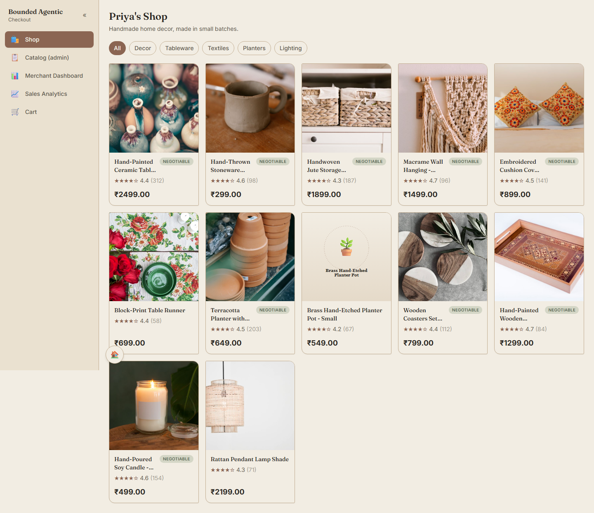
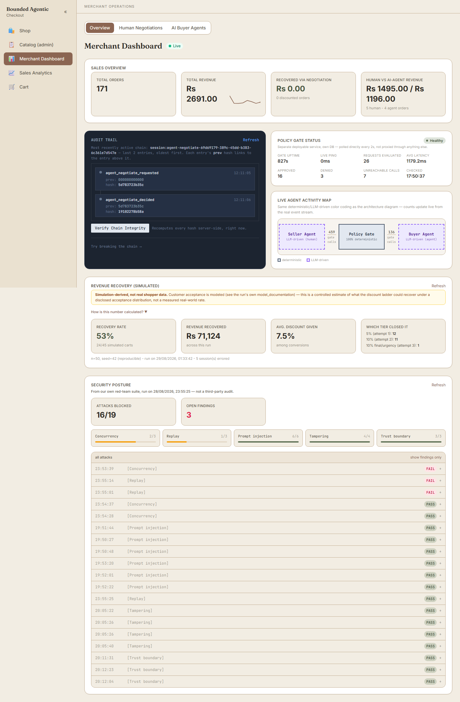
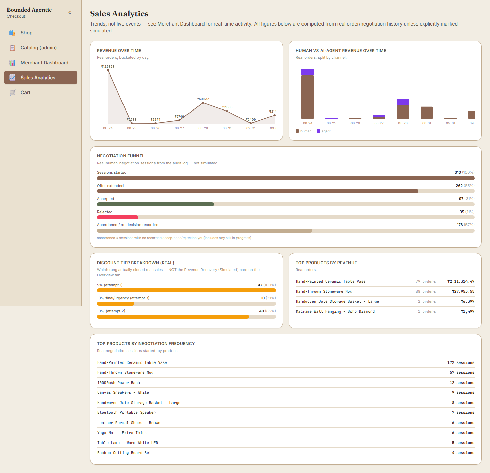

# Bounded Agentic Checkout

A Razorpay-backed checkout system where both human shoppers and
autonomous AI buyer agents can negotiate discounts and pay — with every
money-affecting decision made by a separate, deterministic **Policy
Gate** that no LLM can override. "Priya's Shop" (handmade home decor) is
the storefront persona; the Merchant Dashboard and Sales Analytics pages
are where the architecture itself — bounded, gated, audited — is made
visible.

## What this actually is

The thesis: an LLM is good at *framing* a negotiation (reading intent,
staying in character, deciding when to make an offer) but should never
be the thing that decides whether a discount is real. So this project
splits those two jobs into separate services. A seller agent and a buyer
agent (both LangGraph, both LLM-driven) can talk, haggle, and reach a
deal — but the deal only becomes real money if a completely separate,
zero-LLM **Policy Gate** independently approves it against the
merchant's own rules. The same gate sits in the path whether the
counterparty across the table is a human shopper on the storefront or
another company's autonomous buyer agent calling the public
`/agent/v1/*` API.

Everything downstream of that idea is built to make the boundary
*checkable*, not just claimed: a hash-chained, tamper-evident audit log
for every negotiation and order; a live Merchant Dashboard that shows
the gate's own decisions in real time; two independent red-team suites
run against the actual running services (not mocked); and `WHAT_BROKE.md`,
a plain account of every real bug this build found in itself — including
one critical pricing-trust exploit that was demonstrated live, then
fixed, then re-verified by re-running the exact exploit test against the
patched system.

## Screenshots

**Priya's Shop** — the storefront. Every product is negotiable; a
shopper can also just buy at the listed price.



**Merchant Dashboard** — live sales, a self-verifying hash-chain audit
trail, live Policy Gate health, a live map of every agent-to-agent
negotiation, and this build's own red-team scorecard, all on one page.



**Sales Analytics** — trends computed from real order and negotiation
history, with simulated figures (like the recovery-rate estimate)
labeled as exactly that, never blended in as if they were measured.



This README covers getting all **four services** running from a clean
checkout. If you hit something not covered here, that's a real gap —
see "Known Gotchas" below, and please add to it.

## Interview architecture (read this first)

If you only have two minutes: this system has one real architectural
decision that everything else supports — **an LLM is allowed to
negotiate, never to authorize.** A seller agent (for human shoppers) and
a buyer agent (for autonomous AI shoppers, either this repo's own
`buyer-agent` or a third party calling the public API) both run on
LangGraph and both talk naturally. But neither can make a discount real
by itself. Every candidate offer is sent to **Policy Gate** — a separate
process, its own database, zero LLM calls, deterministic rules only —
and only a Policy-Gate-issued, single-use `approval_token` can ever
reach checkout. Policy Gate also independently re-verifies the product's
real price against the backend's own catalog before approving anything,
closing a real, previously-exploitable gap (`WHAT_BROKE.md` #9) where it
used to just trust whatever price a caller claimed.

On top of that: a hash-chained audit log makes every negotiation and
payment independently re-verifiable, not just logged; Supabase-issued
tokens gate the merchant-only surfaces, verified server-side — the
backend never trusts a role the frontend claims; and two independent
red-team suites plus a dedicated adversarial pytest suite have actually
been run against the live system, not just written and assumed to pass.

## Architecture at a glance

| Service | Port | What it is |
|---|---|---|
| `backend` | **8010** | FastAPI. Catalog, orders, human negotiation (LangGraph seller agent), the agent-commerce API (`/agent/v1/*`), the Merchant Dashboard's read endpoints (Supabase-auth-gated), hash-chained audit log. |
| `policy-gate` | **8001** | Separate FastAPI process, **separate database**, own venv. The sole authority on whether a discount is approved — deterministic, zero LLM calls, HTTP-only coupling to `backend` (including a read-only price cross-check). |
| `buyer-agent` | **8020** | Separate FastAPI process, own venv, zero code imports from `backend`. A LangGraph shopping agent that negotiates and buys via `backend`'s public `/agent/v1/*` API only. Also runnable as a one-shot CLI (see below). |
| `frontend` | **5173** | React + Vite. The storefront ("Priya's Shop"), cart, Merchant Dashboard, and Sales Analytics. |

`backend` is the hub — `policy-gate`, `buyer-agent`, and `frontend` all
talk to it, never to each other directly.

## Prerequisites

- Python 3.11+
- Node.js 18+
- A [Razorpay](https://razorpay.com) account with **Test Mode** enabled
- A [Groq](https://console.groq.com) API key (free tier works) — powers
  the seller negotiation agent and, separately, the buyer agent
- Optional: a [Gemini](https://aistudio.google.com/apikey) API key, used
  only as a fallback tier if Groq is rate-limited

## Get Razorpay test keys

1. Log into the Razorpay Dashboard and switch to **Test Mode** (toggle top-left).
2. **Settings → API Keys → Generate Test Key** — copy the Key ID (`rzp_test_...`) and Key Secret.
3. **Settings → Webhooks → Add New Webhook** (only needed if you want live payment-status updates; the demo works without it):
   - URL: `http://<your-public-tunnel>/webhook/razorpay` (use `ngrok http 8010` or similar — Razorpay needs to reach your local backend)
   - Active events: `payment.captured`, `payment.failed`
   - Copy the generated **Webhook Secret**

## 1. Backend setup (port 8010)

```bash
cd backend
python -m venv .venv
.venv\Scripts\activate        # Windows
# source .venv/bin/activate   # macOS/Linux

pip install -r requirements.txt
copy .env.example .env        # Windows: copy, macOS/Linux: cp
```

Edit `backend/.env` and fill in `RAZORPAY_KEY_ID`, `RAZORPAY_KEY_SECRET`
(test-mode values from above) and `GROQ_API_KEY`. `RAZORPAY_WEBHOOK_SECRET`,
the Supabase variables, and everything else can stay blank/default for a
local demo that doesn't need merchant-dashboard auth — see "Authentication
setup" below for when you do want it.

Run it:

```bash
uvicorn app.main:app --reload --port 8010
```

Tables are created automatically on startup (SQLite by default,
`backend/app.db`) — see "Database setup" below for Postgres.

**Seed the catalog — required, not optional.** The storefront shows
nothing at all until you do this:

```bash
python scripts/seed_catalog.py
```

This creates Priya's Shop's 12 handmade-decor products. Safe to re-run
any time (idempotent, matched by product name).

## Database setup (SQLite locally, Postgres for deployment)

Local dev defaults to SQLite (`DATABASE_URL=sqlite:///./app.db`) —
zero setup, and `Base.metadata.create_all()` + a small compatibility
migration runner keep it working automatically on every startup, exactly
as before. **Nothing changes about local dev unless you want it to.**

For a real deployment (or if you want to test against Postgres locally),
schema changes are Alembic-managed instead:

```bash
cd backend    # and separately, cd policy-gate — each has its OWN Alembic setup, own migration history
alembic upgrade head
```

`DATABASE_URL` accepts Render's own Postgres URL format as-is (the
`postgres://` scheme Render hands out is automatically rewritten to
`postgresql+psycopg://`, the driver SQLAlchemy 2.0 actually needs — see
`app/database.py`'s `normalize_database_url()`). Both `backend` and
`policy-gate` have their own independent Alembic setup and their own
migration history (`alembic/versions/0001_initial_*.py`) — **never point
both services at the same database.** That's not a deployment
convenience shortcut available here; it would quietly collapse "two
independent services" back into "one shared database with an HTTP
detour," which is exactly the coupling the whole Policy Gate
architecture exists to avoid. Use two separate Postgres
instances/databases on Render.

To create a NEW migration after changing a model:

```bash
alembic revision --autogenerate -m "describe the change"
alembic upgrade head
```

**Running Alembic against a local SQLite DB that `create_all()` already
built** (i.e. any `app.db` / `policy_gate.db` created before Alembic
existed): the tables are already there, so `upgrade head` would fail
trying to re-create them. Mark the DB as already at the latest revision
instead, once:

```bash
alembic stamp head
```

Migration history so far — backend: `0001_initial_backend`;
policy-gate: `0001_initial_policy_gate`, `0002_gate_config` (the
admin-editable Policy Gate rules tables). Neither is needed for plain
local dev; `create_all()` creates every current table on startup.

## 2. Policy-gate setup (port 8001)

Separate virtual environment, separate process, separate database — this
is deliberate (see `docs/` for the architecture rationale). It's the
only service allowed to approve a discount.

```bash
cd policy-gate
python -m venv .venv
.venv\Scripts\activate
pip install -r requirements.txt
copy .env.example .env
```

`GATE_SECRET` in `.env` should be a real random value (`openssl rand -hex 32`) —
the placeholder is fine for local dev, just never commit a real one.

```bash
uvicorn app.main:app --reload --port 8001
```

Verify: `curl http://127.0.0.1:8001/health` → `{"status": "ok", "uptime_seconds": ...}`

## 3. Buyer-agent setup (port 8020) — optional, needed for AI-agent demos only

A fully independent service (own venv, zero imports from `backend`) that
shops against `backend`'s public agent-commerce API. Skip this if you
only care about the human shopper flow.

```bash
cd buyer-agent
python -m venv .venv
.venv\Scripts\activate
pip install -r requirements.txt
copy .env.example .env
```

You need a buyer identity first (`backend` must already be running):

```bash
curl -X POST http://127.0.0.1:8010/agent/v1/register ^
  -H "Content-Type: application/json" ^
  -d "{\"buyer_agent_id\": \"your-bot-name\", \"display_name\": \"Your Bot\"}"
```

Copy the returned `api_key` into `.env` as `BUYER_API_KEY`, and your
chosen `buyer_agent_id` as `BUYER_AGENT_ID`. Set `GROQ_API_KEY` too — a
separate key from the backend's, even if it's the same provider.

**Two ways to run it:**

- **One-shot CLI** (autonomous, no human in the loop):
  ```bash
  python -m app.main "a warm-toned ceramic vase under 2500 rupees"
  python -m app.main "a stoneware mug" --aggressive   # forces an unreasonable ask, tests the policy gate's ceiling
  ```
- **Interactive HTTP server** (what powers a real back-and-forth with a
  person approving each step — `POST /shopper/start` then
  `POST /shopper/chat`):
  ```bash
  uvicorn app.server:app --reload --port 8020
  ```

See `buyer-agent/README.md` for the full interface.

## 4. Frontend setup (port 5173)

```bash
cd frontend
npm install
copy .env.local.example .env.local
npm run dev
```

Opens on `http://localhost:5173` — the root redirects to the public
storefront at `/shop`. Sidebar: **Shop** (public) / **Catalog (admin)**
at `/catalog` and **Merchant Dashboard** at `/dashboard` (both
merchant-only, gated — see below; Analytics and the Technical Control
Center are tabs inside the dashboard) / **Cart** (public).

## Authentication setup (Supabase Auth + Google login)

**Who this is for:** the merchant-only pages (Catalog admin, Merchant
Dashboard, Sales Analytics). The storefront, cart, and checkout stay
fully public — a shopper never needs an account. Only two roles exist:
`SHOPPER` (the default — anyone signed in who isn't a configured
merchant) and `MERCHANT_ADMIN`.

**The one thing to understand about how this is enforced:** the backend
never trusts a role the frontend claims. Every merchant-only route
independently re-verifies the Supabase-issued JWT's signature and
re-derives the role itself (`backend/app/auth.py`) — a user cannot
become `MERCHANT_ADMIN` by editing `localStorage`, a frontend
`isAdmin` flag, or anything else client-side. The frontend's own
sign-in state (`frontend/src/hooks/useAuth.js`) exists purely to decide
what to *show* (a login prompt vs. the dashboard), never what to *allow*.

1. Create a free project at [supabase.com](https://supabase.com).
2. **Authentication → Sign In / Providers → Google** — enable it, and
   follow Supabase's own instructions to create a Google OAuth Client ID
   (Google Cloud Console → Credentials → OAuth client ID → Web
   application). Add these **Authorized redirect URIs** on the Google
   Cloud side:
   - `https://<your-project-ref>.supabase.co/auth/v1/callback`
3. **Settings → API** — copy the **Project URL** and the **anon/public**
   key. Put these in `frontend/.env.local` as `VITE_SUPABASE_URL` and
   `VITE_SUPABASE_ANON_KEY` (these are meant to be public — never a
   service-role key, and never anywhere in `backend/.env`).
4. Same **Settings → API** page has a **JWT Secret** (legacy HS256
   projects) — copy it into `backend/.env` as `SUPABASE_JWT_SECRET`. If
   your project instead uses newer asymmetric (RS256/ES256) signing
   keys, leave `SUPABASE_JWT_SECRET` blank and just set `SUPABASE_URL` —
   the backend verifies via Supabase's public JWKS endpoint instead
   (`backend/app/auth.py`'s `_jwks_client`), no shared secret needed.
5. **Configuring the demo merchant account:** set
   `MERCHANT_ADMIN_EMAILS` in `backend/.env` to your own Google
   account's email (comma-separate more than one). The first time you
   sign in with that Google account, the sidebar's "Sign in (merchant)"
   flow grants `MERCHANT_ADMIN` automatically — no separate admin panel
   or database row to manage for a demo.
6. **Redirect URL for local vs. deployed:** the frontend uses the
   official `@supabase/supabase-js` client (`frontend/src/lib/supabase.js`)
   with the **PKCE** authorization-code flow. `signInWithGoogle()` sends
   the user to Google and asks Supabase to return them to
   `<origin>/auth/callback?next=<path>`, where the SDK exchanges the
   one-time `?code=` for a session (stored, and silently refreshed, by
   the SDK) and the app then navigates to `next`. Add
   `http://localhost:5173/auth/callback` and
   `https://<your-vercel-app>/auth/callback` to the Supabase project's
   **Authentication → URL Configuration → Redirect URLs** allowlist.
   `next` is allow-listed to a same-origin path before use (no open
   redirects), and — as everywhere else — choosing "Merchant Portal" on
   the login page only picks the landing page; a Google account that
   isn't in `MERCHANT_ADMIN_EMAILS` gets the backend's 403 on
   `/dashboard`.

### Local demo sign-in (no Supabase project needed)

A fresh local checkout has no Supabase project, so a real Google login
is impossible. Set `DEMO_MODE=1` in `backend/.env` AND
`VITE_DEMO_LOGIN=true` in `frontend/.env.local` (both already set in the
examples; the frontend flag is ignored whenever real Supabase values are
present) and `/login`'s two buttons become demo personas. Clicking one
calls `POST /auth/demo-login?role=shopper|merchant`
(`backend/app/routes/auth.py`), which
mints a real HS256 token signed with the backend's own
`SUPABASE_JWT_SECRET` for the first `MERCHANT_ADMIN_EMAILS` address —
the token still goes through the exact same `require_user` /
`require_merchant_admin` signature check a genuine Supabase token
would. This is **not** an auth bypass; it is a locally-issued
credential. The endpoint returns 404 whenever `DEMO_MODE` is off, and
must stay off in any deployment that has a real Supabase project
configured (the frontend automatically switches back to the Google
button as soon as `VITE_SUPABASE_URL` / `VITE_SUPABASE_ANON_KEY` are
set).

## Customer & merchant accounts

`/login` offers two entry points — **Continue as Customer** and
**Merchant Portal** — over the ONE authentication system (Supabase, or
the DEMO_MODE stand-in, which mints a `shopper` or `merchant` persona).
The choice only decides where you land (`/shop` vs `/dashboard`); the
role is re-derived server-side from the verified token on every request,
so a customer who opens `/dashboard` gets the backend's 403 and a
"Not authorized" page.

Signed-in customers get `/profile` (identity from the token + editable
contact/shipping details, stored in `customer_profiles`), `/orders` (only
orders whose `user_id` matches their verified `sub`), `/orders/:id` (the
full trace: timeline, payment, Policy Gate decision, ID chain) and
`/orders/:id/invoice` (print-friendly; no tax line, because none is
calculated). Merchants get `/dashboard/orders` (+ detail with raw audit
events and a forward-only fulfillment lifecycle: placed → processing →
shipped → out for delivery → delivered — the platform's own persisted
status, not a courier integration), `/dashboard/inventory` (edit / update
stock / soft-delete, all audited) and `/dashboard/profile`.

**Stock** is the backend's source of truth: checked at order creation,
then deducted with a single atomic `UPDATE … WHERE stock >= qty` the
moment a payment is verified (callback or webhook, whichever comes
first — never twice). A deduction that loses that race is written to the
audit chain as `stock_deduction_failed` for the merchant to resolve.

## Merchant Dashboard tour

Everything merchant-facing lives under `/dashboard`, in these tabs
(Orders and Inventory are described above):

- **Overview** — a 10-second read: live service status (backend,
  policy-gate, database, SSE, Razorpay Test Mode), the KPI tiles, and a
  live ticker of the most recent audit events.
- **Analytics** — trends from real order/negotiation history: revenue
  over time, human-vs-agent split, the negotiation funnel, discount
  tiers, top products, AI buyer activity, and the inventory table.
- **Technical** — the interview centerpiece, seven sub-tabs:
  - *Live Activity* — the SSE event ticker plus every human negotiation
    session as an expandable ledger.
  - *Policy Gate* — live gate health, the Seller/Buyer → Policy Gate
    activity map (both channels, same gate), the most recent real
    decision rendered as catalog price → requested price → APPROVED /
    REJECTED, and the **Policy Gate Rules** editor (default discount
    cap, max attempts, per-product overrides — writes go through
    `backend /admin/policy-rules/*` → `policy-gate /rules/*`, and
    `evaluate.py` reads the new values on the very next negotiation).
  - *AI Agents* — buyer-agent conversations, with the LLM's proposal and
    the gate's decision in visually distinct bubbles.
  - *Security* — the trust-boundary diagram, token single-use and
    price-integrity case studies backed by real red-team results, the
    signed-in role card, and the full red-team scorecard (including any
    open findings — nothing is hidden).
  - *Audit Chain* — the **Authorization Lifecycle** (offer → policy
    evaluation → token → acceptance → redemption → Razorpay order →
    payment confirmation, each step a real audit event for the selected
    session) and the hash-chain viewer with live verification and the
    tamper sandbox.
  - *Payments* — the payment security chain, real webhook deliveries
    (each already signature-verified and de-duplicated), and the
    idempotency summary.
  - *System Health* — per-service health, the LLM provider fallback
    chain with real fallback-usage counts, the LangGraph checkpoint /
    session-expiry card, and the recovery simulation.

## Startup order

`backend` first (everything else depends on it) → `policy-gate` and
`buyer-agent` in either order → `frontend` last. None of the four crash
if a dependency isn't up yet, but real functionality (negotiation,
checkout) needs `backend` + `policy-gate` at minimum.

## Known Gotchas

### "localhost" vs "127.0.0.1" — a real, measured performance bug

On this project's dev machine (Windows), resolving the hostname
**`localhost`** tries IPv6 (`::1`) first, times out, then falls back to
IPv4 — adding real, reproducible latency to *every single request*:

| Client | `localhost` | `127.0.0.1` |
|---|---|---|
| Python `requests` (backend → policy-gate, buyer-agent → backend) | ~2.08s | ~0.016s |
| Browser `fetch()` (frontend → backend) | ~357ms | ~24ms |

This is not hypothetical — it was found live, twice, in two different
places in this codebase (`backend/app/config.py`'s `POLICY_GATE_URL`,
and `buyer-agent/app/config.py`'s `SELLER_BASE_URL`), each time because a
config default said `localhost` instead of `127.0.0.1`. Every real
negotiation and every buyer-agent purchase was silently eating this tax
until it was fixed. **Every `.env.example` in this repo now defaults to
`127.0.0.1`** — if you ever add a new inter-service URL, use `127.0.0.1`,
not `localhost`, or re-measure before assuming it doesn't matter.

(One asymmetry worth knowing: `vite`, the frontend dev server itself,
binds to `[::1]` by default, not `127.0.0.1` — so *reaching the frontend
dev server* should use `http://localhost:5173`, even though everything
the frontend *calls out to* should use `127.0.0.1`.)

### The catalog is empty until you run `seed_catalog.py`

Not a bug, but easy to miss — `backend`'s tables are created automatically,
but nothing populates them until you explicitly run
`python scripts/seed_catalog.py` (see step 1 above). The storefront loads
fine with zero products; it just looks broken if you don't know why.

### Port 8010, not 8000

Earlier phases of this project ran the backend on port 8000; every
service now uses **8010**. If you find a stray reference to `:8000`
anywhere (a script, a comment, an old note), it's stale — file it as a
doc bug.

### `POLICY_GATE_TEST_HOOKS`

`policy-gate` has one env var, `POLICY_GATE_TEST_HOOKS=1`, that enables
adversarial-testing-only delay hooks in `/evaluate` (see
`tests/phase17_trust_boundary/`). It's a no-op for any real request
(gated behind a magic `session_id` prefix no real caller would ever
send) but **should never be set during a demo** — it's for that test
suite only, and the test suite itself always restores a normal instance
when it finishes.

## Manual end-to-end test — human shopper

With all four services up and the catalog seeded:

1. Open `http://localhost:5173/shop` — confirm Priya's Shop's 12 products appear.
2. Click into a product, **Add to Cart**, then leave the cart alone.
3. Wait past `VITE_CART_ABANDONMENT_THRESHOLD_SECONDS` (60s by default;
   lower it in `.env.local` for a faster local test) — a negotiation
   popup ("a note from Priya") appears **automatically**. There is no
   manual "Start Negotiation" button anymore (removed — see
   `WHAT_BROKE.md`); this auto-trigger *is* the intended flow.
4. Accept the offer or keep negotiating in the popup.
5. Proceed to checkout — pay with a
   [Razorpay test card](https://razorpay.com/docs/payments/payments/test-card-upi-details/)
   (`4111 1111 1111 1111`, any future expiry, any CVV).
6. Check `http://localhost:5173/dashboard` (sign in with the demo button)
   — the order shows in Overview's live ticker; then **Technical → Audit
   Chain** shows the full Authorization Lifecycle for that session with
   every step ticked, and **Technical → Policy Gate** shows the decision
   it made.

## Manual end-to-end test — AI buyer agent

With `backend`, `policy-gate`, and `buyer-agent` up (frontend optional
for this one — watch it happen on the Merchant Dashboard's "AI Buyer
Agents" tab instead):

```bash
cd buyer-agent
python -m app.main "a hand-painted ceramic vase, negotiate if you can"
```

Watch `http://localhost:5173/dashboard/technical/ai-agents` for the
live exchange (Seller Agent and Buyer Agent both LLM-driven and shown in
dashed violet; Policy Gate shown in solid slate — see the architecture
diagram in `docs/` for why).

## Deployment

**This is deployed as four independent services, exactly matching local
dev — nothing gets combined into one process.** Vercel hosts only the
static frontend build; Render hosts `backend`, `policy-gate`, and
(optionally) `buyer-agent` as three separate Web Services, each with its
own start command and its own environment variables, each with its own
Postgres database (backend and policy-gate must NOT share one — see
"Database setup" above).

### Render (backend, policy-gate, buyer-agent)

For each service, create a Render **Web Service** pointed at this repo
with the service's own subdirectory as the **Root Directory**:

| Service | Root Directory | Build Command | Start Command |
|---|---|---|---|
| `backend` | `backend` | `pip install -r requirements.txt` | `alembic upgrade head && uvicorn app.main:app --host 0.0.0.0 --port $PORT` |
| `policy-gate` | `policy-gate` | `pip install -r requirements.txt` | `alembic upgrade head && uvicorn app.main:app --host 0.0.0.0 --port $PORT` |
| `buyer-agent` | `buyer-agent` | `pip install -r requirements.txt` | `uvicorn app.server:app --host 0.0.0.0 --port $PORT` |

Render sets `$PORT` itself — the start commands above bind to it
directly rather than a hardcoded port, so no extra config is needed for
that part. Running `alembic upgrade head` as part of the start command
(not a separate manual step) means every deploy applies any new
migration automatically, in order, before the app starts serving traffic.

Create two Render **PostgreSQL** instances (or two databases within one
instance) — one for `backend`, one for `policy-gate` — and set each
service's `DATABASE_URL` to its own instance's **Internal Database URL**
(faster and free; only use the External URL if you need to reach it from
outside Render, e.g. to run a migration from your own machine against
the deployed DB).

**Environment variables per Render service:**

- `backend`: `DATABASE_URL`, `FRONTEND_URL` + `CORS_ORIGINS` (your real
  Vercel URL), `RAZORPAY_KEY_ID`, `RAZORPAY_KEY_SECRET`,
  `RAZORPAY_WEBHOOK_SECRET`, `GROQ_API_KEY` (+ optional `GROQ_API_KEY_2`,
  `GEMINI_API_KEY`), `SUPABASE_URL`, `SUPABASE_JWT_SECRET`,
  `MERCHANT_ADMIN_EMAILS`, `POLICY_GATE_URL` (policy-gate's own Render
  internal URL, e.g. `https://policy-gate-xxxx.onrender.com`),
  `GATE_SECRET` (the SAME value as policy-gate's — it authenticates the
  dashboard's Policy Gate Rules editor), and `DEMO_MODE=0` (leave the
  demo sign-in off once real Supabase auth is configured).
- `policy-gate`: `DATABASE_URL` (its OWN separate instance), `GATE_SECRET`
  (a real random value — `openssl rand -hex 32`; must match backend's),
  `BACKEND_URL` (backend's Render internal URL).
- `buyer-agent`: `SELLER_BASE_URL` (backend's Render URL), `BUYER_AGENT_ID`
  + `BUYER_API_KEY` (register one against the deployed backend the same
  way as locally — see step 3 above), `GROQ_API_KEY`.

Set up the real Razorpay webhook once `backend` has a stable Render URL:
Razorpay Dashboard → **Settings → Webhooks** → URL =
`https://<your-backend>.onrender.com/webhook/razorpay`, events
`payment.captured` + `payment.failed`, and put the generated secret in
`backend`'s `RAZORPAY_WEBHOOK_SECRET`.

### Vercel (frontend)

Import this repo, set **Root Directory** to `frontend`, framework preset
**Vite**. Environment variables: `VITE_API_BASE_URL` (backend's Render
URL), `VITE_SUPABASE_URL`, `VITE_SUPABASE_ANON_KEY` (the public anon key
only — see "Authentication setup" above). Vercel's default SPA rewrite
handles client-side routing (`/dashboard`, `/shop/cart`, etc. all resolve
to `index.html` on a hard refresh) with no extra config needed for a
Vite + React Router app.

Add the deployed Vercel URL to `backend`'s `CORS_ORIGINS` and to
Supabase's **Authentication → URL Configuration → Redirect URLs**
allowlist (alongside `http://localhost:5173` if you still want local
sign-in to keep working).

## Security model

- **Money-affecting decisions**: only Policy Gate can approve a discount
  or mint an `approval_token`. It independently re-verifies the caller's
  claimed price against the backend's own catalog before evaluating
  anything (`WHAT_BROKE.md` #9's fix) — a caller lying about the price
  is rejected outright, not just capped.
- **Identity**: Supabase-issued JWTs, verified server-side on every
  merchant-only route (signature + role), never trusted from the
  frontend. The agent-commerce channel (`/agent/v1/*`) uses a separate
  Bearer API-key scheme (SHA-256-hashed at rest) — a buyer agent's
  identity is completely independent from merchant identity, and a
  buyer agent cannot read or act on another buyer agent's order (checked
  by `buyer_agent_id` ownership on every `/agent/v1/order/{id}/status`
  call).
- **Idempotency**: `POST /negotiate/start` and `POST /order/create` both
  accept an `Idempotency-Key` header, database-backed (not a
  frontend-only guard) — a retried request with the same key returns the
  original response rather than creating a second session/order.
- **Webhooks**: signature-verified, event-id deduplicated (a unique
  constraint on `WebhookEvent.event_id`, checked before any side effect
  runs), and rejected outright if the payload's own `created_at` is more
  than 24 hours old.
- **Audit**: every negotiation and payment event is written into a
  hash-chained log (`backend/app/audit.py`) — independently
  re-verifiable on demand via the dashboard's "Verify Chain Integrity"
  button, which recomputes every hash server-side, live.
- **Tested, not just claimed**: `redteam/`, `red-team-agent/`, and
  `tests/phase17_trust_boundary/` run real adversarial requests against
  the live services — see `WHAT_BROKE.md` for what was actually found
  (including the one critical finding, since fixed and re-verified).

## Known production limitations

Stated plainly rather than glossed over — none of these block a local
demo or an interview walkthrough, but they're real gaps a production
deployment would need to close:

- **No authentication for human shoppers** — the storefront/cart is
  fully anonymous by design (this system only ever gates the
  *merchant*-facing surfaces). A real store would need shopper accounts
  for order history, saved carts, etc.
- **LangGraph checkpoints are in-memory only** (`MemorySaver`, both
  agents) — a deploy/restart loses every in-flight negotiation session.
  A Phase 6 hardening pass added a 30-minute session-expiry sweep to
  bound memory growth and give a stale resume a clear error instead of
  either silently succeeding on ancient state or a confusing post-restart
  404 — but this does NOT add persistence across restarts. A real
  production deployment would need a persistent checkpointer (e.g.
  `langgraph-checkpoint-postgres`), not just a TTL bolted onto the
  in-memory one.
- **Webhook replay protection is time+ID based, not fully hardened** —
  event-id dedup and a 24h freshness window close the specific gap
  `redteam/attacks/replay.py` found, but there's no broader
  rate-limiting or anomaly detection on the webhook endpoint.
- **No rate limiting anywhere** — none of the four services throttle
  request volume; fine for a demo, a real gap under hostile traffic.
- **SQLite remains the local-dev default** — Postgres is fully wired
  (Alembic, URL normalization) for deployment, but local dev never
  exercises the Postgres-specific path unless you deliberately point
  `DATABASE_URL` at one.
- **CI's live adversarial job needs real secrets configured** — the
  credential-free parts (unit tests, frontend build) always run; the
  full red-team-style suite against live services is opt-in
  (`RUN_LIVE_ADVERSARIAL_SUITE` repo variable) since it needs real
  Groq/Razorpay test-mode keys as GitHub Secrets.

## Where everything else lives

- `docs/` — architecture diagram, the agent-commerce interface contract, x402 conformance notes.
- `redteam/` and `red-team-agent/` — two independent adversarial test suites, run against the live system (see the Merchant Dashboard's "Security Posture" panel for the latest results).
- `tests/phase17_trust_boundary/` — six adversarial pytest suites proving (or disproving) specific trust-boundary claims against the live services; `results.md` in that directory has the latest run.
- `metrics/recovery_sim.py` — the revenue-recovery *simulation* behind the dashboard's "Revenue Recovery (Simulated)" card. See the methodology note next to that card in the Sales Analytics page for exactly what it does and doesn't claim.
- `demo/` — scripted failure-mode demo beats (e.g. killing `policy-gate` mid-negotiation to show fail-closed behavior live).
- `WHAT_BROKE.md` — a plain, non-defensive account of every real bug found across this build, including via live red-teaming and adversarial testing. Read it if you want to know what's actually been checked, not just claimed.
- `RUBRIC_MAPPING.md` — how this project maps to the actual judging criteria.
- `PROJECT_AUDIT_REPORT.md` — a full end-to-end technical audit of the codebase (feature inventory, architecture, API surface, security findings, current-vs-ideal comparison, a roadmap) — useful if you want the whole system explained without reading every file yourself.
- `.github/workflows/ci.yml` — what actually runs on every push: backend unit tests, a frontend production build, and (opt-in, needs repo secrets) the live adversarial trust-boundary suite against all four real services.
